# Documentação Modelo Preditivo - Inteli

## LaPlace

### LaPlace

#### Ana Carolina Cremonezi Martire, Antônio Bahia Fonseca Moraes, Freddy Mester Harari, Isabelle Beatriz Vasquez Oliveira, João Pedro Rodrigues Sotto Maior, Mauro das Chagas Junior

## Sumário

[1. Introdução](#c1)

[2. Objetivos e Justificativa](#c2)

[3. Metodologia](#c3)

[4. Desenvolvimento e Resultados](#c4)

[5. Conclusões e Recomendações](#c5)

[6. Referências](#c6)

<br>

## <a name="c1"></a>1. Introdução

&emsp;&emsp;A *PowerCo* é uma empresa global de energia, atuando nos setores de petróleo, gás natural e energias renováveis. Com sede na França, a empresa opera em diversas partes do mundo, abrangendo desde a exploração e produção de petróleo e gás até a comercialização e distribuição de produtos energéticos. Além disso, a *PowerCo* investe em tecnologias e soluções voltadas para energias limpas e sustentáveis, como a solar e eólica. No mercado, a empresa é reconhecida como uma das maiores empresas integradas de energia, buscando uma abordagem equilibrada entre a produção convencional e a transição para fontes mais limpas.

&emsp;&emsp;O problema que foi resolvido neste projeto é o alto índice de saída dos clientes (churn) no segmento de pequenas e médias empresas, sem um monitoramento para identificar quais clientes estão mais propensos ao churn. Além disso, a *PowerCo* possui apenas hipóteses sobre essas causas, o que dificulta a seleção adequada de um plano de ação para evitar esse churn. A empresa necessitava de uma análise mais detalhada dos dados para compreender as verdadeiras alavancas que levam os clientes a esse problema.

<br>

## <a name="c2"></a>2. Objetivos e Justificativa

### 2.1 Objetivos

&emsp;&emsp;O parceiro de negócios visava o desenvolvimento de um sistema que permiteria entender e prever o comportamento de churn. Essa compreensão é vital para aumentar a retenção e fidelização dos clientes, permitindo a implementação de estratégias mais eficazes e personalizadas. Para isso, existem certos objetivos que foram alcançados:

**Coleta e Análise de Dados**: Utilizar dados históricos e em tempo real para analisar o comportamento dos clientes e identificar os principais indicadores associados ao churn.

**Desenvolvimento de Modelo Preditivo**: Criar um modelo de aprendizagem de máquina que possa calcular a probabilidade de churn com base nos indicadores identificados. O modelo deve ser robusto e capaz de adaptar-se às mudanças nas tendências do mercado.

**Implementação de Estratégias de Retenção**: Com base nas previsões do modelo, desenvolver estratégias direcionadas para reter os clientes em risco de churn. Isso pode incluir ofertas especiais, programas de lealdade, ou comunicação personalizada.

**Monitoramento e Avaliação Contínua**: Implementar um sistema de monitoramento que permita acompanhar a eficácia das estratégias de retenção e ajustá-las conforme necessário. Avaliar regularmente o desempenho do modelo e atualizá-lo para manter sua precisão e relevância.

<br>

### 2.2 Proposta de solução

&emsp;&emsp;A proposta de solução oferecida pela *LaPlace* para o problema de churn na *PowerCo* envolvia o desenvolvimento de um modelo preditivo robusto, que foi projetado para identificar os clientes mais propensos a abandonar os serviços e para compreender as principais alavancas que contribuem para esse churn. Para entregar os resultados esperados, a solução foi dividida em diferentes componentes:

**Análise Exploratória de Dados (EDA)**

- Identificação dos padrões, tendências e relações entre os diferentes atributos presentes nos dados, como preços, informações de cadastro dos clientes e histórico de churn.
- Investigação da hipótese de sensibilidade aos preços aplicados.

**Pré-processamento de Dados**

- Limpeza e transformação dos dados para garantir que o modelo funcione de maneira eficiente.
- Criação de variáveis de categoria ou binárias para elementos-chave, como segmentos de mercado (pequenas e médias empresas).

**Modelo de Churn**

- Utilização de algoritmos de aprendizagem de máquina, como Random Forest e Gradient Boosting, que têm demonstrado eficácia em tarefas de classificação.
- Ajuste de hiperparâmetros e validação cruzada para encontrar o modelo mais adequado.

**Identificação das Principais Alavancas**

- Análise da importância das features para determinar quais são os principais fatores que levam ao churn, por exemplo, preços, qualidade do serviço e etc.
- Avaliação da hipótese de que descontos poderiam ser uma alavanca para reduzir o churn através de simulações.

**Métricas de Avaliação**

- Utilização de métricas como precisão, recall, F1-score, e AUC-ROC, com maior foco na última, para medir o sucesso do modelo.

**Simulação de Estratégias de Redução de Churn**

- Simulação de diferentes estratégias de desconto e outras medidas para prever o impacto na retenção de clientes.

**Implantação**

- Fornecimento de orientação estratégica sobre como o modelo deve ser utilizado nos contextos de negócios específicos da *PowerCo*.
- Proposta de um plano de teste prático para avaliar o modelo no ambiente real da empresa.

**Documentação e Boas Práticas de Código**

- O modelo foi bem documentado e segue boas práticas de código para garantir a fácil manutenção e escalabilidade.

<br>

### 2.3 Justificativa

&emsp;&emsp;A escolha de um modelo preditivo para resolver o problema de churn de clientes é uma decisão estratégica que reflete uma abordagem moderna e baseada em dados para um dos desafios mais persistentes no mundo dos negócios. Para escolher qual método utilizar, deve-se levar em consideração as necessidades e objetivos de negócio, além dos recursos disponíveis para análise. Modelos preditivos oferecem uma forma rigorosa, quantitativa, e frequentemente mais precisa para prever o churn quando comparado com outros métodos.

&emsp;&emsp;Existem diversas formas de prever ou estimar a chance de churn de um cliente, algumas das alternativas sendo: análise cohort, feedback do cliente e pesquisas, análise competitiva, dentre outras. No entanto, o modelo preditivo proposto apresenta vantagens distintas em relação a essas alternativas:

1. **Eficiência e Precisão**: A utilização de técnicas de aprendizagem de máquina, como Random Forest, Gradient Boosting, e redes neurais, possibilita a análise de uma grande quantidade de dados e a identificação de padrões complexos que podem não ser percebidos por análises mais simples. Essa abordagem aumenta a precisão das previsões e pode resultar em estratégias de retenção mais eficazes.
2. **Personalização**: O modelo proposto permite a criação de estratégias de retenção personalizadas para diferentes segmentos de clientes. Ao entender as alavancas específicas que levam ao churn em diferentes grupos, a empresa pode desenvolver ofertas e comunicações direcionadas que sejam mais propensas a serem eficazes.
3. **Adaptabilidade**: A natureza adaptável do modelo torna-o capaz de se ajustar às mudanças nas tendências e comportamentos do mercado. Isso significa que a empresa pode continuar a utilizar o modelo ao longo do tempo, fazendo ajustes conforme necessário para mantê-lo relevante e eficaz.
4. **Compliance e Segurança**: A solução proposta enfatiza a conformidade com as regulamentações de privacidade e segurança, garantindo que os dados dos clientes sejam tratados com o cuidado adequado.
5. **Suporte Continuado e Consultoria**: Oferecemos não apenas uma solução técnica, mas também o suporte contínuo e consultoria necessários para integrar o modelo nas operações diárias da empresa. Isso inclui fornecer orientação sobre como utilizar o modelo de maneira eficaz e propor planos de teste práticos.
6. **Inovação e Competitividade**: Implementar uma solução preditiva para o problema de churn demonstra um compromisso com a inovação e a utilização de tecnologia de ponta. É um diferenciador competitivo no mercado, destacando a empresa como líder em análise de dados e gestão de clientes.
7. **ROI Tangível**: Através da simulação de diferentes estratégias de desconto e medidas de retenção, o modelo pode ajudar a empresa a encontrar a abordagem mais econômica, maximizando o retorno sobre o investimento.

&emsp;&emsp;Em resumo, a proposta não só atende aos objetivos gerais e específicos do parceiro de negócios, como também se destaca em termos de eficiência, personalização, adaptabilidade, e suporte contínuo. Essa abordagem integral coloca a *PowerCo* em uma posição favorável para lidar com o problema do churn de maneira eficaz, maximizando a retenção de clientes e contribuindo para o crescimento sustentável da empresa.

<br>

## <a name="c3"></a>3. Metodologia

&emsp;&emsp;O CRISP-DM consiste em uma metodologia ágil focada na iteração e compreensão de problemas de mineração de dados. Esse método se destaca pela sua grande utilidade em cenários de incerteza quanto ao problema do negócio, tendo em vista que cada uma de suas etapas precisa da validação das anteriores para seguir em frente e as etapas seguintes influenciam nas anteriores, assim criando um processo cíclico que itera sobre si mesmo. Dessa forma, gera-se maior compreensão do que precisa ser feito, entedimento dos dados e construção de uma solução coerente e que satisfaça o problema.

&emsp;&emsp;No contexto do projeto, a metodologia CRISP-DM foi utilizada no processo de compreensão do problema a ser resolvido e dos dados disponíveis para a resolução do mesmo. Para isso, das 6 etapas do CRISP-DM (Compreensão do negócio, entedimento dos dados, preparação dos dados, modelagem, avaliação e implantação) foram passadas pelas 5 primeiras, visando a iteração pelo processo conforme mais era compreendido acerca da solução que deveria ser construída.

**Métodos utilizados em cada etapa:**

**1. Compreensão do negócio:** Para a compreensão do negócio e do problema a ser resolvido, utilizamos das principais estratégias de negócios, sendo elas: o uso da "Matriz SWOT" para compreender o cenário interno e externo da empresa, "5 Forças de Porter" para a compreensão das forças que podem impactar a empresa, "Matriz de Riscos" para compreender os riscos em volta do desenvolvimento do projeto e da equipe, "Personas" para a compreensão de quem seriam os usuários principais da solução, e o "Value Proposition Canvas" para compreender o que o modelo preditivo proposto poderia agregar em valor para a empresa. Ademais ao uso dessas estratégias, uma série de conversas e alinhamentos foram realizados com o cliente com o intuito de garantir a compreensão e cumprimento do que foi determinado para o projeto.

**2. Entedimento dos dados:** Para a compreensão dos dados, além de conversas e alinhamentos com o cliente, foi realizada a leitura do documento com a explicação de todas as features presentes nas tabelas. Além disso, foi realizado um trabalho de visualização dos dados por meio da plotagem de gráficos, matrizes de correlação e da busca de compreender quais eram as principais features relacionadas com nossa variável target e como poderiamos codificá-las para seu uso eficiente para o modelo.

**3. Preparação dos dados:** A presença de dados faltantes e ruidosos em bases de dados é um desafio constante para qualquer projeto de ciência de dados. Precisamente por conta disso, é necessário saber como tratar valores que possam influenciar negativamente o desempenho do modelo, além de saber como utilizar bem as features presentes para o processo de predição. Para a prepração dos dados foram usadas técnicas de preenchimento de valores negativos, faltantes e incoerentes por meio de técnicas de agrupamento, normalização das colunas numéricas, one-hot-encoding e label encoding para colunas categóricas, identificação e retirada de outliers que poderiam adicionar ruído aos modelos, além de um trabalho de abstração de certas colunas para garantir seu uso mais otimizado para os modelos.

**4. Modelagem:** Para o processo de modelagem, foram utilizados 5 modelos bases para os testes, sendo eles: Catboost, KNN, Random forest, XGboost e regressão logística. Esses 5 modelos foram utilizados como base para a realização de testes a partir da modificação da base de dados, principalmente por meio de técnicas de oversampling, undersampling e SMOTE, tendo essa última sido usada com 4 variações da mesma (SMOTE simple, SMOTE-ENN, SMOTE-Boost e ADASYN).

**5. Avaliação:** Para avaliação dos modelos treinados e seleção de um primeiro modelo, foram utilizadas como métricas principais a Matriz de Confusão dos modelos para a verificação dos verdadeiros positivos, falsos positivos, verdadeiros negativos e falsos negativos, a métrica AUC-ROC que, em suma, mede a capacidade do modelo de diferenciar entre as classes, e a métrica Recall, que mede a capacidade do modelo de acertar os verdadeiros positivos. Outras métricas que foram utilizadas para compreender o panorama geral do problema e suportar as citadas anteriormente foram a acurácia e o F1-score.

**6. Implantação:** Etapa ainda em processo.

A metodologia CRISP-DM é um processo iterativo e dinâmico, e a volta em cada uma dessas etapas é uma parte importante da construção de uma solução sólida e que satisfaça o que o cliente precisa.

<br>

## <a name="c4"></a>4. Desenvolvimento e Resultados

### 4.1. Compreensão do Problema

#### 4.1.1. Contexto da indústria

&emsp;&emsp;Nos últimos anos, as indústrias de produção e distribuição de energia elétrica têm passado por diversas mudanças e desafios significativos, principalmente em relação à transição energética e às novas políticas de sustentabilidade.

&emsp;&emsp;Toda a Europa tem se empenhado em acelerar os processos de transição para energias mais sustentáveis. Por isso, muitas políticas de redução de emissão de carbono e promoção da produção de energias renováveis, como solar, eólica, hidrelétrica e biomassa, têm sido implementadas visando combater de forma mais eficaz as mudanças climáticas. A produção de eletricidade proveniente de combustíveis fósseis está sendo gradualmente substituída por fontes renováveis e consideradas mais limpas. Um exemplo disso é o aumento da produção de energia com gás natural, que desempenha um papel importante na indústria europeia.

&emsp;&emsp;Além disso, houve grandes investimentos em infraestrutura de energia, que abrangem desde a expansão das redes de distribuição e transmissão de eletricidade até a construção de terminais de gás natural liquefeito para facilitar o comércio global, bem como a modernização de usinas de energia para se adequarem às novas tecnologias.

&emsp;&emsp;Algumas empresas desse ramo que se destacaram nesse processo foram: EDF (Electricité de France), uma das maiores produtoras e distribuidoras de eletricidade na Europa; Enel, que atua na geração, distribuição e comercialização de energia; e RWE, uma empresa alemã que tem sido historicamente forte na geração de energia a partir de carvão, mas também tem investido em energias renováveis e na redução das emissões de carbono.

&emsp;&emsp;Atualmente, as empresas de energia elétrica estão utilizando modelos preditivos baseados em dados energéticos para mitigar perdas não técnicas, dentre outras aplicações. A aplicação da aprendizagem de máquina surge como uma ferramenta poderosa para amplificar a precisão e eficácia das análises em empresas que lidam com grandes volumes de informações.

&emsp;&emsp;Toda essa análise pode ser feita com o método das 5 Forças de Porter, um modelo que, de acordo com o site <i>Templum</i>, "propõe ao gestor compreender cinco contextos (ou as cinco forças), nos quais uma empresa está inserida". Esse método direciona o processo de análise dos elementos ambientais de qualquer empresa, e analisa a competitividade de um mercado. Ele engloba a rivalidade entre concorrentes, o poder de negociação dos fornecedores e dos compradores, as ameaças de novos entrantes, e ameaças de produtos substitutos. Essas forças moldam a dinâmica competitiva de uma indústria, influenciando estratégias de negócios e tomadas de decisão, então é de extrema importância entendê-las para melhor compreender o seu mercado.

<br>
<p align="center">
   <b>Figura 01 -</b> 5 Forças de Porter
</p>
   <p align="center">
      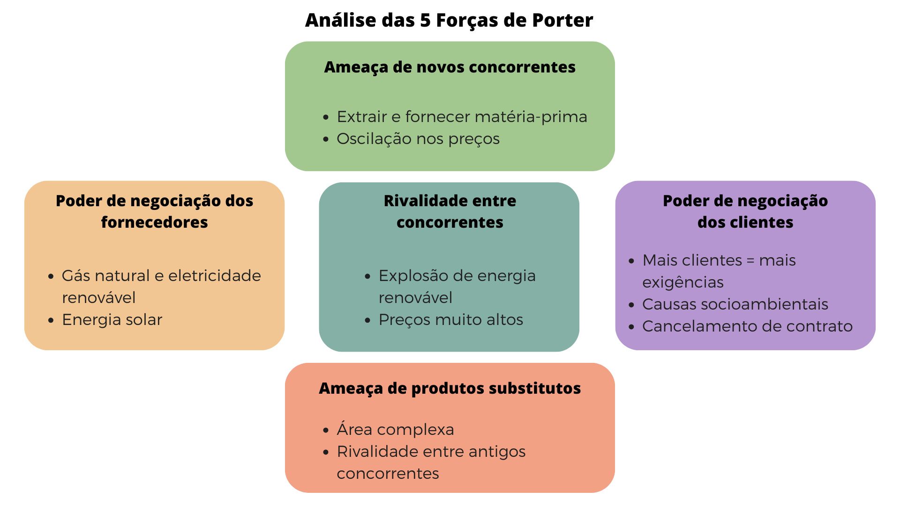</a>
   </p>
<p align="center">
   Fonte: Elaboração própria
</p>
<br>

<b>Poder de negociação dos fornecedores:</b>

&emsp;&emsp;O poder de negociação dos fornecedores da *PowerCo* é notavelmente amplo, já que eles possuem o papel de extrair e fornecer a matéria prima, fazendo com que a empresa possa realizar as transformações e processos necessários e, assim, efetivamente gerar energia. Situações problemáticas, como a guerra na Ucrânia, crises energéticas, falta de recursos naturais, competição com outras empresas, e até mesmo ações contra a extração podem fazer com que os fornecedores oscilem em seus preços e fornecimento, assim impactando negativamente nos negócios da *PowerCo*.

<b>Poder de negociação dos clientes:</b>

&emsp;&emsp;Os clientes da *PowerCo* são consumidores de energia, principalmente da Europa. Devido a grande variedade de fontes energéticas da *PowerCo*, há uma grande concentração de clientes, o que é positivo do ponto de vista dos negócios, mas que também aumenta o poder de exigência dos mesmo que estão cada vez mais envolvidos em causas socioambientais. Isso acaba aumentando a cobrança para que a *PowerCo* atenda essas demandas, o que pode ser um desafio, dado que a matriz energética da Europa é principalmente de gás e combustíveis fósseis. A *PowerCo* também lida com o desafio do cancelamento de contratos de clientes, possivelmente pelos preços de seus serviços, tendo perdido contratos em 2022, assim recorrendo à medidas de Machine Learning para mitigar o problema.

<b>Ameaças de produtos substitutos:</b>

&emsp;&emsp;O setor de energia é vital para a sociedade, e uma área muito estável em sua base, já que não houve grandes mudanças (mesmo se analisarmos seu começo na 2° revolução industrial). Na Europa, as principais fontes de energia sempre foram provenientes de combustíveis fósseis e gás natural. Mesmo com outras alternativas, como hidrelétricas ou usinas eólicas, essas fontes ainda são predominantes por questões geográficas e até políticas. Sendo assim, a *PowerCo* não possui tantas ameaças quanto a um produto substituto, porém, embora ainda lentamente, novas propostas têm surgido, como o uso de energia solar em todos os aparelhos que a Tesla propõe por meio da tecnologia Powerwall. Mesmo que ela ainda seja só utilizada em carros elétricos, essa tecnologia possui potencial para mudar a matriz energética se tornar um interesse das nações.

<b>Ameaça de novos concorrentes:</b>

&emsp;&emsp;O setor de energia e combustíveis ao qual pertence a *PowerCo* é uma área complexa de se inserir, principalmente por questões de estrutura e da variedade de setores energéticos. Além disso, ela também já se encontra entre as maiores companhias do setor energético da Europa, ficando apenas atrás da multinacional Shell PLC, de acordo com o ranking feito pela "Value.Today". Levando isso em consideração, a ameaça de novos concorrentes é menor, embora a rivalidade entre os concorrentes já estabelecidos é bem mais expressiva.

<b>Rivalidade entre concorrentes:</b>

&emsp;&emsp;À medida que as energias renováveis ganham destaque e os preços da energia tradicional permanecem elevados, a rivalidade entre as grandes empresas do ramo energético aumenta consideravelmente. A luta pela participação no mercado e redução de custos operacionais se tornam ainda mais intensas. Estratégias de diferenciação e parcerias estratégicas se tornam meios vitais para manter a competitividade.

<br>

#### 4.1.2. Análise SWOT

&emsp;&emsp;A Matriz SWOT, de acordo com o site <i>Lucidchart</i> é "uma ferramenta de estudo visual que pode ser usada para identificar pontos fortes e fracos específicos em situações de vida pessoal e profissional. Ela ajuda a tomar decisões e planejar o futuro." A matriz analisa certos aspectos de uma empresa, englobando as suas forças (S), fraquezas (W), oportunidades (O) e ameaças (T), tais siglas correspondendo à palavra em inglês. A Matriz SWOT é aplicada quando gestores buscam uma visão mais ampla do que pode influenciar sua trajetoria, além de buscar reconhecer recursos que eles já possuem, assim tendo uma melhor visão das dificuldades e desafios que podem vir pela frente. Dessa forma, a empresa consegue entender melhor o que faz bem e onde pode melhorar, além de conseguir tomar decisões sobre como melhorar sua posição competitiva e alcançar seus objetivos de negócios.

<br>
<p align="center">
   <b>Figura 02 -</b> Análise SWOT
</p>
   <p align="center">
      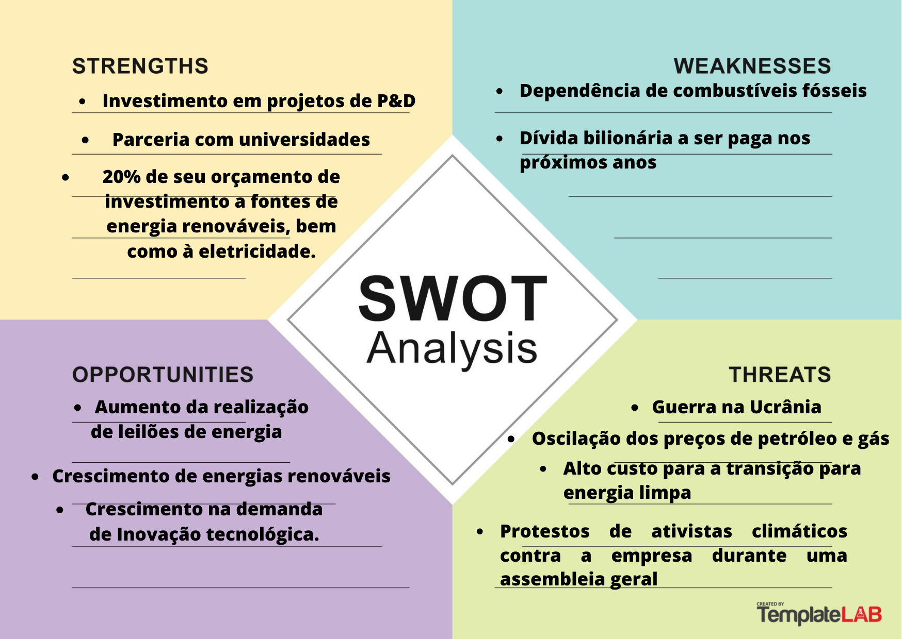</a>
   </p>
<p align="center">
   Fonte: Elaboração própria
</p>
<br>

&emsp;&emsp;Ao realizar a análise SWOT, é necessária a análise de diversos vetores sobre a empresa em questão. A *PowerCo* se destaca no quesito de forças, já que a empresa tem investido cada vez mais em projetos de P&D e em fontes de energias renováveis que tem tido um grande aumento de procura nos últimos anos. A empresa é a 4ª maior companhia de óleo e gás do mundo, e líder global em energia com baixa emissão de carbono e pode crescer ainda mais devido às diversas oportunidades que o mercado de energia elétrica. Além disso, cada vez mais a *PowerCo* investe em aumentar o número de locais de operação chegando a atuar em mais de 130 países.

&emsp;&emsp;Apesar do foco em energia renovável, a transição de energia é um investimento extremamente caro, principalmente para uma empresa que tem como principal fonte de receita fontes de energia não renováveis. Além disso, é importante considerar que a empresa tem uma dívida bilionária que deve ser considerada como prioridade para buscar maior estabilidade no crescimento da empresa.

<br>

#### 4.1.3. Planejamento Geral da Solução

&emsp;&emsp; O planejamento geral de uma solução envolve a elaboração de uma estratégia abrangente para desenvolver e implementar o modelo em questão. Isso inclui várias etapas, como a definição dos dados disponíveis para o problema, qual problema precisa de solução e qual foi a solução proposta a partir disso, sem contar seus benefícios. Além disso, a escolha do algoritmo ou técnicas de modelagem a serem empregadas também é um fator importante, e a definição de métricas para avaliar a eficácia do modelo. 

**a) Dados disponíveis**  
&emsp;&emsp;Os dados disponíveis para a resolução do problema são de 3 bases disponibilizadas pelo parceiro. A primeira base corresponde aos dados dos clientes, como seus contratos, informações de consumo, dados de seus serviços e informações de seu histórico com a companhia. A segunda base apresenta dados do histórico de preços pagos pelos clientes, tanto os preços fixos quanto os variáveis, todos separados por data e período. A terceira base apresenta o histórico de churn dos clientes e é a base que será utilizada para treinamento e teste do modelo.

**b) Solução proposta**  
&emsp;&emsp;A solução proposta é um modelo preditivo que, passado o processo de tratamento dos dados e de diversos testes de features, será capaz de prever o churn dos clientes, apresentar sua probabilidade e os principais motivos que causam essa decisão dos clientes por meio de modelos de regressão logística.

**c) Tipo de tarefa**  
&emsp;&emsp;O problema que precisa de solução é de classificação, tendo em vista que é necessário fazer uma previsão binária entre um cliente fazer ou não o churn. As informações adicionais que serão passadas, como a probabilidade do cliente dar churn ou não, pode ser obtida por meio de algoritmos de regressão logística.

**d) Modo de utilização da solução proposta**  
&emsp;&emsp;A solução proposta será um modelo preditivo que apresentará as informações do churn dos clientes, a probabilidade deles darem churn e possíveis alavancas que estão causando isso. Sendo assim, a forma de utilizar a solução é inserir os dados dos clientes que se deseja prever, obter os outputs e utilizar essas informações para criar estratégias de mitigação dos problemas baseado nas principais alavancas causadora deles.

**e) Benefícios trazidos pela solução proposta**  
&emsp;&emsp;A solução proposta apresenta o principal benefício de predizer os clientes que darão churn com base nas informações de histórico de outros clientes. Além disso, a solução apresenta os principais motivo que levaram os clientes a tomarem essa decisão, fazendo com que ações específicas para lidar com cada um desses problemas possam ser realizadas com maior eficiência.

**f) Critério de sucesso e métrica utilizada para avaliação**  
&emsp;&emsp;Para avaliar o sucesso do modelo, será feita uma comparação de seu nível de acurácia com a de modelos que utilizam outros algoritmos para fazer a predição, assim sendo possível identificar os melhores algoritmos e fazer as predições de acordo com o conjunto de dados disponível. Ademais, classificadores aleatórios foram utilizados para obter uma métrica base e, assim, availiar os modelos preditivos que serão utilizados.

<br>

#### 4.1.4. Value Proposition Canvas

&emsp;&emsp;A Proposta de Valor é uma ferramenta de análise de produtos que tem como objetivo compreender a perspectiva do usuário e como o produto se propõe a abordar determinados aspectos desse contexto. O site <i>Cursospm3</i> define-a como uma matriz que "indica qual será o valor agregado ao consumidor se ele adquirir o produto daquela empresa.", além de ser parte do Business Model Canvas, outro modelo utilizado no entendimento do negócio de uma empresa.

&emsp;&emsp;Em relação ao usuário, são avaliados três elementos principais: suas "atividades" (ações necessárias para resolver o problema), "pontos de dor" (fatores que geram a necessidade de uma solução) e "benefícios" (resultados esperados após a solução). No que diz respeito ao produto, os termos correspondentes são "produtos / serviços" (oferta que viabiliza a realização das atividades), "alívios" (componentes do produto que conseguem mitigar os pontos de dor do usuário) e "criadores de benefícios" (recursos desenvolvidos para potencializar os benefícios alcançados).

&emsp;&emsp;Como pode-se ver na figura a seguir, em relação à *PowerCo*, suas atividades ("customer jobs") são analisar as estatísticas de churn e entender seus principais motivos. Esses aspectos são o que a *LaPlace* realizou, é o que a empresa busca entender. Os pontos de dor ("pains") e benefícios ("gains") são, respectivamente, os incômods e demandas do cliente. A *PowerCo* se frusta por perder clientes por conta dos churns, pela incerteza na tomada de decisões (já que não entende a causa dos seus clientes "churnarem"). E, em contrapartida, a empresa pede que a *LaPlace* identifique os principais motivos de churn, entenda o perfil dos clientes, para, então, diminuir essa quantidade.

&emsp;&emsp;Falando sobre a proposta do projeto, os "products & services", a *LaPlace* criou um modelo preditivo na linguagem <i>python</i> que prevê as maiores causas de churn dos clientes da *PowerCo*. Para ajudar a remediar os pontos de dor, foram introduzidos alívios ("pain relievers"), como um ranking contendo os índices mais altos de churn, além de suas causas, e uma tabela indicando as melhores abordagem para cada situação de churn. Por fim, os chamados criadores de benefício ("gain creators") são o que esses alívios entregam para o cliente. Por conta do ranking e das tabelas criados, a *PowerCo* consegue entender o perfil dos seus clientes que "churnaram" e que têm chances disso e, assim, saber o que fazer para diminuir essa porcentagem.

<br>
<p align="center">
   <b>Figura 03 -</b> Proposta de Valor
</p>
   <p align="center">
      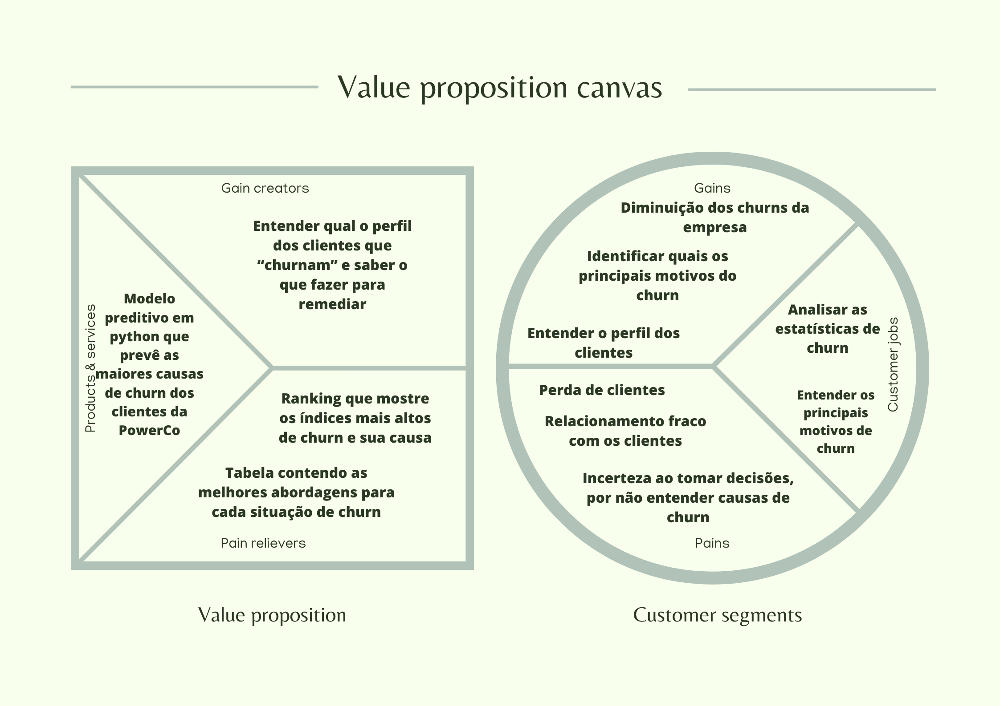</a>
   </p>
<p align="center">
   Fonte: Elaboração própria
</p>
<br>

&emsp;&emsp;Em suma, a Proposta de Valor é um elemento chave para entender os desejos do cliente e como o produto irá atendê-los. Com a proposta criada para a *PowerCo*, foi possível entender de forma clara o que a empresa quer e o que a *LaPlace* deveria fazer (e fez) para atender aos seus pedidos. Dessa forma, todos ficam contentes com o resultado final do produto.

<br>

#### 4.1.5. Matriz de Riscos

&emsp;&emsp;A matriz de riscos, segundo o <i>esferablog</i> é "uma ferramenta utilizada para avaliar a probabilidade de um evento acontecer e quais seriam os impactos (consequências), ou seja, de que forma ele afetaria o ambiente de trabalho." Ela é uma tabela dividida em probabilidade (eixo vertifcal) e o impacto que isso terá na empresa (eixo horizontal).

&emsp;&emsp;Com base nas probabilidades de riscos identificados, a estratégia do grupo e de prevenção visa evitar impactos moderados e catastróficos, adotando medidas preventivas para mitigar esses riscos. Isso inclui a implementação de um esquema de revisão de códigos e compatibilidades, bem como a realização de pesquisas sobre o uso do produto após os testes e organização do grupo para cumprir com as tarefas necessárias.

<br>
<p align="center">
   <b>Quadro 01 -</b> Matriz de Riscos
</p>
   <p align="center">
      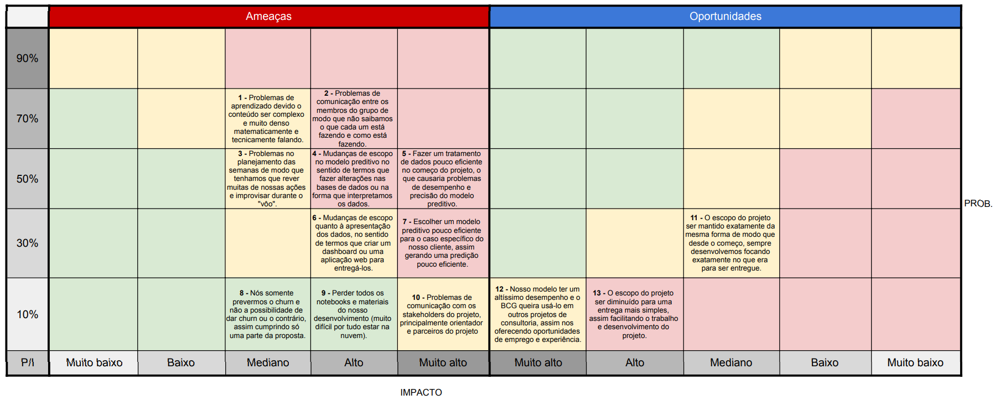</a>
   </p>
<p align="center">
   Fonte: Elaboração própria
</p>
<br>

#### Planos de ação - Ameaças

**1 -** Manter a comunicação ativa com os parceiros do grupo sobre as dificuldades que nas disciplinas, para que seja possível unir conhecimentos, além de sempre buscar os professores e a comunidade Inteli em caso de dúvidas.  
**2 -** Garantir um alto compromisso com as "Dailies", de modo que todos os membros do grupo saibam o que cada um está fazendo e possíveis problemas que acontecem durante o desenvolvimento. Ademais, cabe a cada membro avisar o grupo e o orientador quando estiver com problemas.  
**3 -** Se basear nos artefatos, TAPI e requisitos definidos com o cliente para realizar a planning das Sprints e da semana de modo que as ações da *LaPlace* sempre estejam alinhadas aquilo que realmente é coerente para a entrega do MVP. Ademais, também é importante não aumentar o escopo do projeto desnecessariamente e sem uma conversa e alinhamento com o cliente e PO do projeto.  
**4 -** Manter o contato e validação constante com o cliente sobre as ações de desenvolvimento do modelo preditivo, principalmente quanto a etapa de tratamento de visualização dos dados, de modo que o modelo de aprendizagem de máquina sempre estará usando features coerentes para a resolução do problema.  
**5 -** Principalmente no começo do projeto, focar na etapa do tratamento de dados buscando tirar dúvidas e alinhar o que estamos fazendo com o professor. Além disso, também é positiva a utilização da metodologia CRISP-DM para fazer a gestão dos dados, de modo a manter um processo de trabalho coerente.  
**6 -** Manter a conversa com o PO do projeto e com o cliente para que o escopo fique alinhado ao que foi combinado nas conversas com o parceiro.  
**7 -** Conversar constantemente com o professor sobre as decisões e escolhas do grupo durante desenvolvimento do projeto, além de estudar as melhores opções para as demandas que devem ser resolvidas, assim garantindo a coerência da escolha do modelo preditivo.  
**8 -** Manter a leitura e compreensão do TAPI atualizada de modo a conseguir cumprir essas duas demandas, além de tomar decisões de escolhas de modelos preditivos que nos permitam cumprir os requisitos do projeto.  
**9 -** Manter tudo salvo na nuvem e com cópias como já estamos fazendo.  
**10 -** Manter o engajamento na metodologia SCRUM de modo que o PO e stakeholders do projeto sempre fiquem atualizados do que estamos fazendo.

#### Planos de ação - Oportunidades

**11 -** Manter os planos alinhados ao TAPI e ao que foi solicitado.  
**12 -** Potencializar o aprendizado geral, já que a entrega será mais simples, além de ampliar levemente o escopo com novas ideias e conclusões obtidos da análise dos dados.  
**13 -** Aproveitar a oportunidade para adquirir mais conhecimento e desenvolver ainda mais o MVP que construímos inicialmente.

<br>

#### 4.1.6. Personas

&emsp;&emsp;"Personas" é um conceito de extrema importância para a criação de um bom produto. De acordo com o site <i>Medium</i>, as personas são "pessoas fictícias que se assemelham com os usuários reais de um produto ou serviço". Elas se diferenciam do público-alvo por não serem apenas um conjunto de dados demográficos, mas sim carregarem uma série de dados subjetivos e informações quase pessoais que trazem maior clareza do que precisa ser desenvolvido como produto para elas. De forma bruta, as personas são uma personificação do público-alvo. Então, ao invés de se basear em um númeor altíssimo de pessoas para melhor entender o projeto e quem ele afetará, criam-se personas baseadas nesse público, tornando esse processo mais fácil.

&emsp;&emsp;No contexto do projeto, as personas foram utilizadas com intuito de ampliar a compreensão de quem utilizará o modelo preditivo, que em geral serão cientistas de dados e gestores(as) de contas. Cientistas de dados que trabalharão com a ferramenta a usarão no sentido de inputar novos dados para a análise, além do trabalho de adequação e manutenção do código. Já gestores(as) de contas são responsáveis pelo trabalho mais próximo com os clientes, usando o modelo preditivo como um auxílio para a tomada de decisões, encontrar clientes que possivelmente darão churn e mitigar esse problema para a empresa. As figuras 05 e 06 apresentam maiores detalhes sobre as personas criadas para o projeto.

<br>
<p align="center">
   <b>Figura 04 -</b> Persona 1 (Cientista de Dados)
</p>
   <p align="center">
      </a>
   </p>
<p align="center">
   Fonte: Elaboração própria
</p>
<br>

<br>

<p align="center">
   <b>Figura 05 -</b> Persona 2 (Gerente de Contas)
</p>
<p align="center">
   </a>
</p>
<p align="center">
   Fonte: Elaboração própria
</p>

<br>

&emsp;&emsp;A implementação de "Personas" foi crucial para refinar o projeto, oferecendo uma visão clara e direcionada dos usuários finais. Por meio dessas representações, foi possível alinhar melhor o modelo preditivo às necessidades específicas dos Cientistas de Dados e Gerentes de Contas. As personas, portanto, agiram como guias, assegurando um desenvolvimento mais alinhado e eficiente para o público-alvo.

<br>

#### 4.1.7. Jornadas do Usuário

&emsp;&emsp;A jornada do usuário fornece uma representação gráfica ou narrativa das interações de um usuário com um produto ou serviço ao longo do tempo. Essa representação é construída com base nas personas definidas e detalha as etapas pelas quais um usuário passa para alcançar um determinado objetivo, ilustrando pontos de contato, sentimentos e experiências vividas. Utilizar a jornada do usuário é crucial para identificar oportunidades de melhoria, otimizar a usabilidade e aprimorar a satisfação geral do cliente.

&emsp;&emsp;No contexto deste projeto, a jornada do usuário foi adotada para entender as ações que cada persona realizaria antes, durante e após a utilização do modelo preditivo. Com esse entendimento, foi possível aprofundar a percepção de como a solução proposta afetaria a problemática inicial, resultando na refinamento e adaptação do modelo preditivo para melhor atender às necessidades específicas do cliente.
<br>

##### 4.1.7.1 Entregável do Projeto

&emsp;&emsp;O entregável deste projeto concede*PowerCo* ferramenta _standalone_, na qual os dados dos clientes são inseridos, um a um. Após a análise do modelo, são fornecidos a probabilidade de churn, os principais fatores contribuintes, e recomendações sobre as melhores estratégias de abordagem para cada cenário.

&emsp;&emsp;Abaixo, temos as jornadas de usuário das duas personas definidas para este projeto. A primeira persona é um cientista de dados, que é o usuário final do modelo preditivo. A segunda persona é um gerente de contas, que é o usuário final da ferramenta _standalone_.

<br>
<p align="center">
   <b>Figura 06 -</b> Jornada de Usuário da Persona 1 (Cientista de Dados)
</p>
   <p align="center">
      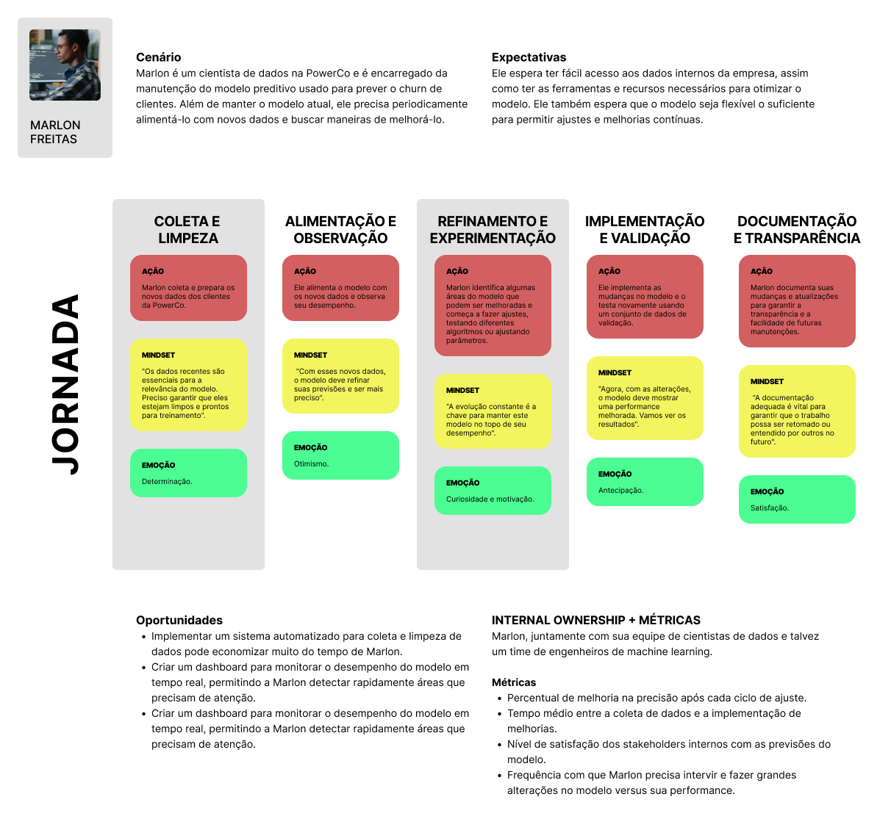</a>
   </p>
<p align="center">
   Fonte: Elaboração própria
</p>
<br>

<br>
<p align="center">
   <b>Figura 07 -</b> Jornada de Usuário da Persona 2 (Gerente de Contas)
</p>
<p align="center">
   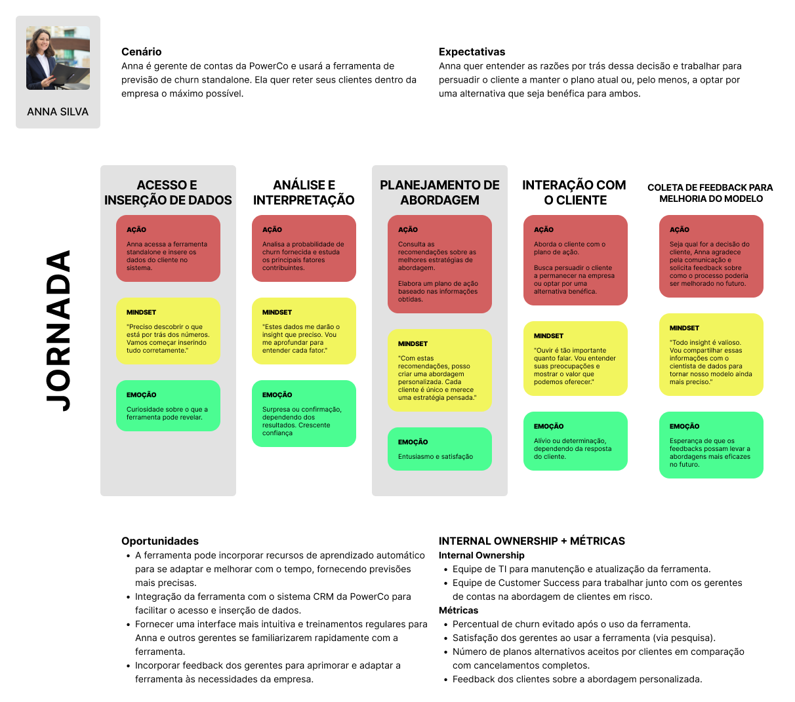</a>
</p>
<p align="center">
   Fonte: Elaboração própria
</p>

<br>

&emsp;&emsp;No contexto do projeto, a jornada de usuário foi utilizada como uma ferramenta para a compreensão dos passos que cada uma das personas fariam durante antes, durante e após o uso do modelo preditivo. Por meio da compreensão dessas etapas, a compreensão de como a solução criada impactaria na solução do problema foi ampliada e, como conclusão, os outputs e o modelo preditivo foram melhorados e adaptados para serem uma resolução mais coerente e personalizada para o cliente.

<br>

##### 4.1.7.2 Proposta de Implementação do Modelo Preditivo em um CRM

&emsp;&emsp;O CRM é uma ferramenta valiosa que permite às empresas construir e manter relações fortes e duradouras com seus clientes. Ela não se limita apenas a um registro de contatos, mas sim a uma abordagem estratégica que envolve entender e atender às necessidades dos clientes em todas as etapas de interação.

&emsp;&emsp; Segundo o blog <i>Resultados Digitais</i>, "CRM (customer relationship management, ou, em português, gestão de relacionamento com o cliente) é um sistema que permite registrar e organizar todos pontos de um contato que um consumidor tem com o vendedor de uma empresa.". Manoela Folador, autora do texto de 2023, ainda se aprofundou um pouco mais. "E vai muito além de uma lista de contatos: o CRM permite que sua empresa construa um relacionamento duradouro com clientes e ofereça a melhor experiência aos consumidores durante todo o processo de venda.". 

&emsp;&emsp;Integrando o modelo preditivo ao CRM, a *PowerCo* terá a vantagem de acessar, de forma automatizada, a probabilidade de churn de cada cliente, assim como compreender os motivos que conduzem a esta eventual decisão. A necessidade de inserção manual de dados em uma ferramenta separada será eliminada, otimizando o processo de análise e tomada de decisão.

&emsp;&emsp;Com essa implementação, Anna, gerente de contas da *PowerCo*, obterá insights valiosos sobre a propensão de churn de cada cliente, auxiliando na elaboração de estratégias mais assertivas para retenção e satisfação dos mesmos.

&emsp;&emsp;Para ilustrar a proposta, foram criadas duas jornadas de usuário especificamente para Anna, detalhando sua interação com o modelo preditivo dentro do CRM.

<br>
<p align="center">
   <b>Figura 08 -</b> Jornada de Usuário da Persona 2 (Gerente de Contas)
</p>
   <p align="center">
      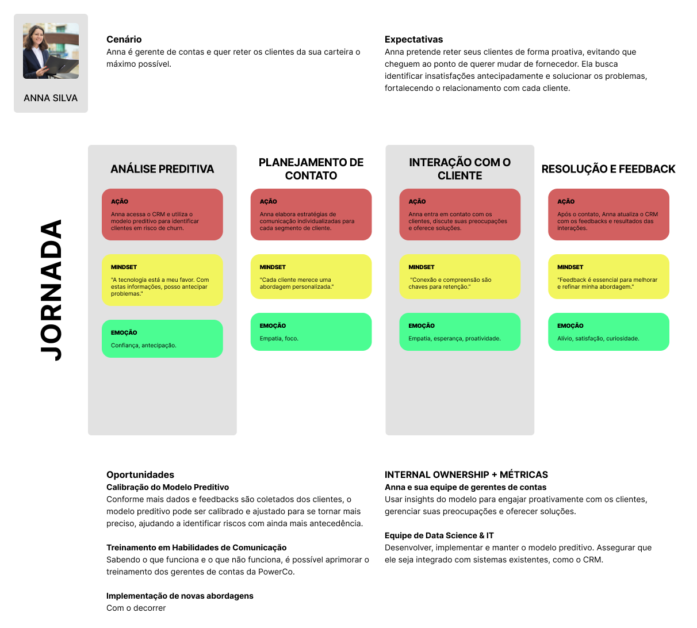</a>
   </p>
   <p align="center">
      Fonte: Elaboração própria
   </p>
<br>

<br>
<p align="center">
   <b>Figura 09 -</b> Jornada de Usuário da Persona 2 (Gerente de Contas)
</p>

<p align="center">
   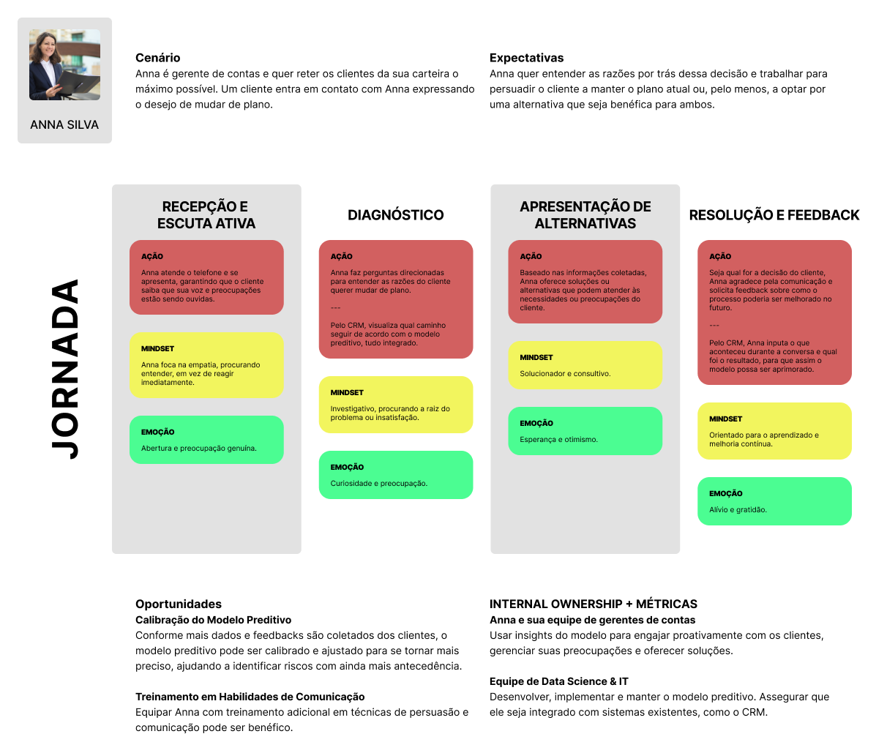</a>
   <p align="center">
      Fonte: Elaboração própria
   </p>
</p>

<br>

&emsp;&emsp;A proposta de implementar o modelo preditivo em um CRM demonstra uma visão evolutiva e pragmática para o projeto, maximizando o valor oferecido à *PowerCo*. Ao eliminar a necessidade de inserção manual de dados e oferecer insights diretamente no ambiente CRM, a empresa pode se beneficiar de uma análise mais fluida e integrada, permitindo ações imediatas e mais assertivas na gestão do relacionamento com seus clientes.

<br>

#### 4.1.8 Política de Privacidade

&emsp;&emsp;Toda empresa deve ter uma política de privacidade, um "conjunto de termos que descreve as práticas adotadas pelo site ou aplicativo em relação às informações dos usuários.", de acordo com o site <i>Advogados Reunidos</i>. Esses termos esclarecem ao visitante do site ou aplicativo em questão como e porque seus dados serão utilizados.

&emsp;&emsp;Para melhor entendimento da *PowerCo*, foram respondidas 11 perguntas sobre sua política de privacidade. Os dados utilizados para a análise estão em seu próprio site, tanto na parte de "cookies" quanto de "privacy", e os links para tais estão nas referências ao final do documento.

**1. Quais dados pessoais são coletados (inclusive os dados não informados pelo usuário, como IP, localização, etc);**  
Há dois tipos de dados coletados:

- Dados de identificação: nome, e-mail, número de telefone.
- Dados de conexão: (IPs, Logs), informações de navegação.

<br>

**2. Onde os dados são coletados (fonte);**  
Os dados são coletados quando o usuário acessa o site da *PowerCo*.

<br>

**3. Para quais finalidades os dados são utilizados;**  
Os dados são utilizados:

- Para que a empresa possa responder por pedidos de informações requisitados pelos clientes;
- Afim de analisar pedidos de inscrição em alertas de e-mail, solicitações de patrocínio e solicitações de publicidade;
- Na criação de uma conta de candidato na área de recrutamento;
- Para o envio de notícias aos seus usuários;
- Para analisar estatísticas.

<br>

**4. Onde os dados ficam armazenados;**  
Com base nos arquivos enviados pelo parceiro de negócios, pode-se inferir que uma parte dos dados é armazenada em arquivo formato .csv. Com isso pode-se também deduzir que parte dos dados é organizada por meio de um banco de dados SQL. Existe a possibilidade de armazenamento em nuvem dado o porte da empresa e modelos NoSQL, embora não haja indícios disso que possamos usar como base.

<br>

**5. Qual o período de armazenamento dos dados (retenção);**  
O período de retenção padrão de dados da *PowerCo* é de 3 anos, com exceção de:

- Dados de identificação para responder aos seus pedidos de informação, que são mantidos pelo tempo necessário de processamento;
- Dados de identificação para responder aos seus pedidos para subscrever alertas de e-mail, continuam armazenados durante toda a duração da subscrição;
- Dados de conexão, mantidos por até 13 meses.

<br>

**6. Uso de cookies e/ou tecnologias semelhantes;**  
A *PowerCo* utiliza cookies em seu site para salvar informações, tanto para o controlador de dados, quanto para o uso de terceiros (Facebook, Twitter, Fastfont, e etc). O controlador de dados os salva para registrar a sessão do usuário dentro do site, assim facilitando seu acesso.

<br>

**7 . Com quem esses dados são compartilhados (parceiros, fornecedores, subcontratados);**  
Esses dados são compartilhados com:

- Departamento de Controle de Dados;
- Subsidiários do grupo *PowerCo*;
- Um ou mais parceiros;
- Distribuidores independentes ou subcontratados, como:
  - Provedores de serviços de marketing;
  - Provedores de serviços de software.

<br>

**8 . Informações sobre medidas de segurança adotadas pela empresa;**  
Na *PowerCo*, o controlador de dados preserva a segurança e confidencialidade dos dados pessoais de seus clientes, evitando que sejam distorcidos, danificados ou divulgados a terceiros não autorizados.

<br>

**9. Orientações sobre como a empresa/organização atende aos direitos dos usuários;**  
Na sessão de privacidade do site da *PowerCo* existe uma visão resumida das Regras Corporativas Vinculantes. O grupo **PowerCo* promove uma cultura e práticas relativas à proteção de dados, de acordo com a legislação aplicável. Esse conjunto de regras é aplicado tanto para os usuários quanto internamente com os funcionários, fornecedores, subcontratados e funcionários de empresas terceirizadas. Ademais, essas regras abrangem princípios de proteção baseado na legislação aplicável da Europa, garantindo sua transparência, relevância e segurança, mantendo os dados longe de acesso não autorizado, destruição, alteração ou perda. Além disso, tais regras ainda garantem os direitos do titular dos dados pessoais, assim fornecendo aos titulares o acesso aos dados, o direito de retificar, apagar, bloquear os dados, se opor ao processamento, e limitar o processamento.

<br>

**10. Informações sobre como o titular de dados pode solicitar e exercer os seus direitos;**  
Na seção de privacidade do site da **PowerCo** existe uma parte destinada a dados pessoais e uso de cookies. Na seção 6, estão presentes instruções de como os titulares dos dados podem entrar em contato com os responsáveis. Nela também fica claro que o titular dos dados possui acesso às suas informações e que tem o direito de acessá-las, corrigi-las, obtê-las e excluí-las. Segue o formulário de contato: https://totalenergies.com/fr/formulaire-de-contact (Acesso em: 7 ago. 2023)

<br>

**11. Informações de contato do Data Protection Officer (DPO) ou encarregado de proteção de dados da organização.**  
Linkedin do 'Head of Legal and Privacy Officer': https://www.linkedin.com/in/alfredzandonadi/ (Acesso em: 7 ago. 2023)

<br>

&emsp;&emsp;Em suma, a *PowerCo* coleta dados pessoais, incluindo informações não fornecidas pelo usuário, como IP e localização, quando os usuários acessam seu site. Esses dados são utilizados para diversas finalidades, como responder a solicitações de informações, análises estatísticas e envio de notícias. Os dados são armazenados por um período padrão de 3 anos, com exceções específicas. A empresa utiliza cookies para melhorar a experiência do usuário, e os dados são compartilhados com departamentos internos, subsidiárias e parceiros. A *PowerCo* adota medidas de segurança para proteger os dados pessoais e fornece orientações claras sobre como os usuários podem exercer seus direitos de proteção de dados. Além disso, há informações de contato do Head of Legal and Privacy Officer disponíveis para questões relacionadas à proteção de dados.

<br>

### 4.2. Compreensão dos Dados

#### 4.2.1. Exploração de dados

&emsp;&emsp;A exploração de dados desempenha um papel fundamental no desenvolvimento de modelos preditivos, pois envolve a análise minuciosa e a identificação de padrões, tendências e relações nos conjuntos de dados disponíveis. Essa etapa permite compreender a natureza dos dados, destacar variáveis relevantes e descobrir possíveis outliers ou inconsistências que podem impactar a qualidade do modelo final. Ao explorar os dados de forma abrangente, os desenvolvedores do projeto podem tomar decisões informadas sobre quais técnicas de modelagem aplicar e como ajustar parâmetros para obter previsões mais precisas e insights significativos.

<br>
<p align="center">
   <b>Quadro 02 -</b> Análise de Dados
</p>
   <p align="center">
      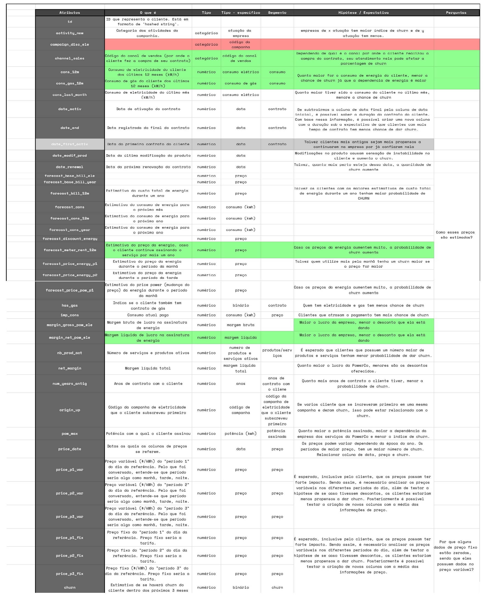</a>
   </p>
<p align="center">
   Fonte: Elaboração própria
</p>
<br>

&emsp;&emsp;Analisar os dados fornecidos pela *PowerCo* nos auxiliou a compreender quais dados podem estar mais relacionados ao churn. Fomos capazes de estruturar as hipóteses a fim de testar quais dados numéricos e categóricos terão maior influência no modelo preditivo, além de priorizar quais colunas serão mais relevantes no desenvolvimento do modelo. Essa abordagem contribuirá para tornar o modelo menos enviesado e mais preciso.

&emsp;&emsp;A análise foi fundamentada em tabelas que construímos utilizando a biblioteca Pandas, incluindo as seguintes:

<br>
<p align="center">
   <b>Tabela 01 -</b> Descrição dos Dados
</p>
   <p align="center">
      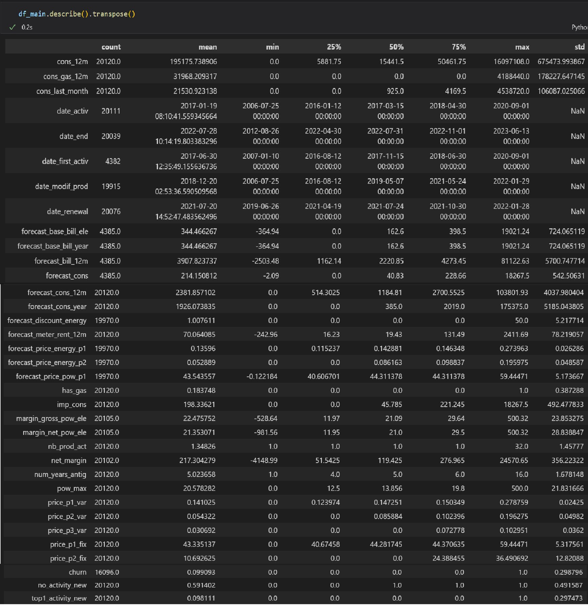</a>
   </p>
<p align="center">
   Fonte: Elaboração própria
</p>
<br>

<br>
<p align="center">
   <b>Quadro 03 -</b> Informações Básicas dos Dados
</p>
   <p align="center">
      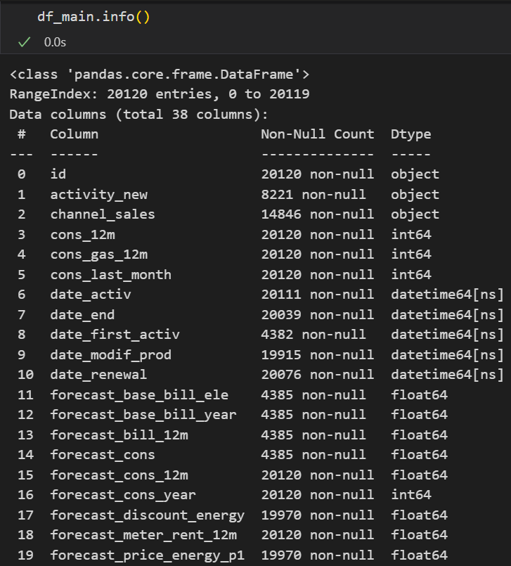</a>
   </p>
<p align="center">
   Fonte: Elaboração própria
</p>
<br>

&emsp;&emsp;Buscando entender melhor a relação entre algumas colunas dos dados fornecidos pela *PowerCo*, criamos alguns gráficos relacionando colunas relevantes da tabela.

&emsp;&emsp;O primeiro gráfico relaciona a coluna 'forecast_bill_12m' e a coluna 'churn' com o objetivo de entender se os clientes com as estimativas mais elevadas do custo total de energia ao longo de um ano têm maior probabilidade de churn.
<br>

<p align="center">
   <b>Gráfico 01 -</b> Gráfico violino dos dados de "forecast_bill_12m" por "churn"
   <p align="center">
      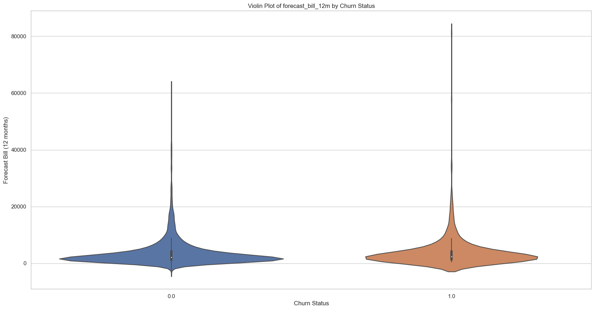</a>
   </p>
<p align="center">
   Fonte: Elaboração própria
</p>
<br>
&emsp;&emsp;O segundo gráfico relaciona a coluna 'cons_gas_12m' e a coluna 'churn' com o objetivo de entender se os clientes que têm gás no contrato e usam pouco gás (ou seja, têm um gasto maior e consumo menor), tenham um índice de churn maior.
<br> <br>

<p align="center">
   <b>Gráfico 02 -</b> Gráfico violino dos dados de "con_gas_12m" por "churn"
</p>
   <p align="center">
      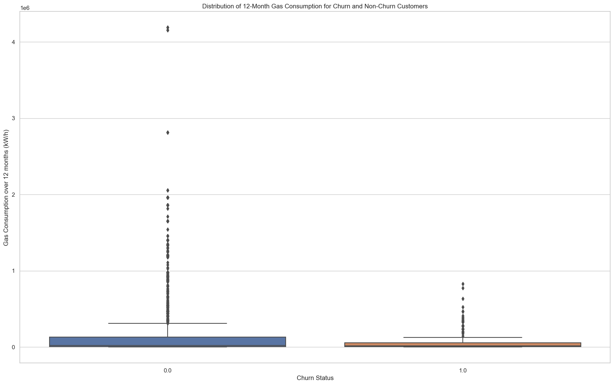</a>
   </p>
<p align="center">
   Fonte: Elaboração própria
</p>
<br>
&emsp;&emsp;O terceiro gráfico relaciona a coluna 'pow_max' e a coluna 'churn' com o objetivo de entender se a potência contratada for maior, existe uma maior dependência da empresa em relação aos serviços da <i>PowerCo</i> e, consequentemente, uma taxa de churn menor.
<br> <br>

<p align="center">
   <b>Gráfico 03 -</b> Gráfico de dispersão dos dados de "pow_max" por "churn"
</p>
   <p align="center">
      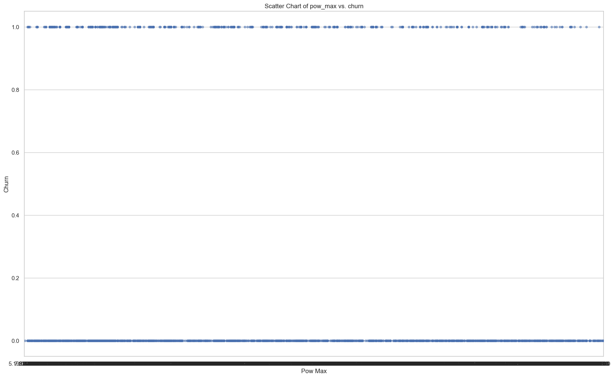</a>
   </p>
<p align="center">
   Fonte: Elaboração própria
</p>

<br>

#### 4.2.2. Pré-processamento dos dados

&emsp;&emsp;O pré-processamento dos dados é uma etapa de suma importância para qualquer problema que envolva a criação de modelos preditivos. Isso porque as informações passadas aos modelos passam por uma série de processos matemáticos complexos que resultam em probabilidades para a classificação ou estimação de um determinado valor dentro de um intervalo. Sendo assim, é de imensa importância que profissionais na área da ciência de dados tenham uma compreensão excepcional do problema para que possam tratar as informações da melhor forma possível, de modo a gerar boas features para treinamento.

&emsp;&emsp;No contexto deste projeto, a metodologia CRISP DM foi fortemente utilizada. Isso significa que, além de realizarmos uma limpeza inicial dos dados, constantemente haverá o retorno à esse processo para que novas abordagens possam ser utilizadas de modo a constantemente melhorar os modelos criados. A limpeza dos dados foi feita de coluna em coluna da tabela, porém foram utilizados processos parecidos para tratar problemas específicos de cada conjunto de dados. Sendo assim, a descrição do que foi feito no pré-processamento será estruturada de acordo com cada caso de limpeza, sendo eles: Tratamento de missing values, codificação de colunas categóricas, remoção de outliers e normalização dos dados. Segue a descrição de cada etapa do pré-processamento.

**Criação do dataframe de treinamento**  
&emsp;&emsp;Com intuito de manter os dados organizados e, ao mesmo tempo, garantir que não serão perdidas informações importantes que poderiam ser trabalhadas posteriormente, as informações foram tratadas em um 'df_main' que contém todos os dados do cliente, mas apenas  as features mais relevantes foram para um 'df', sendo esse novo dataframe o utilizado para treinamento.

```python
# Creating an empty dataframe so that relevant features are placed in it
df = pd.DataFrame()
```

&emsp;&emsp;Essa estratégia foi importante para maior facilidade na alteração dos dados de treinamento, assim garantindo maior eficiência no processo iterativo do CRISP DM.

**Codificação de colunas categóricas**  
&emsp;&emsp;Com intuito de garantir que as colunas categóricas fossem utilizadas da melhor forma possível, foi utilizada a técnica 'one-hot-encoding'. Esse processo consiste em criar novas colunas com valores binários a partir de uma coluna categórica. Ou seja, se existiam 5 categorias em uma determinada coluna, 5 novas colunas serão criadas contendo 1 quando aquela linha tiver a categoria e 0 nas outras 4. A transformação dessas variáveis categóricas em numéricas garante que o computador seja capaz de compreender padrões e estabelecer relações mais facilmente.

&emsp;&emsp;Segue um exemplo de como esse processo foi feito na coluna 'channel_sales':

```python

# Identifying column categories
basic_analysis(df_main, 'channel_sales')

# simplified output:
'''
What are the unique values: ['foosdfpfkusacimwkcsosbicdxkicaua' 'usilxuppasemubllopkaafesmlibmsdf' nan
 'lmkebamcaaclubfxadlmueccxoimlema' 'ewpakwlliwisiwduibdlfmalxowmwpci'
 'sddiedcslfslkckwlfkdpoeeailfpeds' 'epumfxlbckeskwekxbiuasklxalciiuu'
 'fixdbufsefwooaasfcxdxadsiekoceaa']
'''

# Changing 'channel_sales' column values ​​for easier viewing
mapping = {
    'foosdfpfkusacimwkcsosbicdxkicaua': 'A',
    'lmkebamcaaclubfxadlmueccxoimlema': 'B',
    'usilxuppasemubllopkaafesmlibmsdf': 'C',
    'ewpakwlliwisiwduibdlfmalxowmwpci': 'D',
    'sddiedcslfslkckwlfkdpoeeailfpeds': 'E',
    'epumfxlbckeskwekxbiuasklxalciiuu': 'F',
    'fixdbufsefwooaasfcxdxadsiekoceaa': 'G'
}

df_main['channel_sales'] = df_main['channel_sales'].map(mapping)

# As the 'channel_sales' column is categorical, replacing null values with 'null' will allow a new category to be created
df_main['channel_sales'].fillna('null', inplace=True)

# Using .get_dummies to create new numeric features based on the categorical one
channel_sales = pd.get_dummies(df_main['channel_sales'], prefix = 'channel_sales').astype(int)

channel_sales.head(2)

# simplified output:
'''
  | channel_sales_A | channel_sales_B | channel_sales_C | channel_sales_D
- | ---------------   ---------------   ---------------   ---------------
0 |               1 |               0 |               0 |              0
1 |               1 |               0 |               0 |              0
'''

```

&emsp;&emsp;Esse mesmo processo foi realizado para as outras colunas categóricas, sendo essa uma boa estratégia para garantir que categorias possam ser compreendidas pelos algoritmos preditivos.

**Tratamento de valores negativos**

&emsp;&emsp;Valores negativos em contextos que não fazem sentido podem impactar negativamente no modelo, como por exemplo, no caso de valores negativos em colunas de consumo já que um consumo negativo, em geral, não é coerente com a realidade. Precisamente por isso, o primeiro passo foi mapear todas as colunas que possuiam valores negativos pouco coerentes e encontrar a melhor forma de tratá-los. A abordagem escolhida para limpar os valores negativos foi substituí-los por valores mais coerentes com a realidade já que nós não havia como afirmar com certeza que aqueles valores foram colocados por acidente e simplesmente excluí-los poderia retirar informações importantes para o modelo.

&emsp;&emsp;Sendo assim, a estratégia utilizada foi a de buscar correlações fortes entre as variáveis númericas com variáveis categóricas, de modo a agrupar os tipos de clientes com comportamentos parecido para encontrar médias específicas que poderiam preencher esses valores incoerentes, por exemplo, caso a maioria dos clientes com alto consumo sempre optem por um tipo específico de contrato, eu posso agrupá-los e retirar uma média de seu consumo que será muito mais próxima da realidade do que simplesmente fosse tirada a média geral de todos os clientes.

&emsp;&emsp;Segue um exemplo de como esse processo foi feito na coluna 'cons_12m':

```python

# checking for negative values
df_main['cons_12m'].describe().round(2)

# simplified output:
'''
count       20120.00
mean       194964.85
std        675479.22
>> min       -125276.00
25%          5832.75
50%         15334.50
75%         50355.00
max      16097108.00
'''

# Identified negative values ​​so they can be handled correctly
negative_cons_12m = df_main[df_main['cons_12m'] < 0]

negative_cons_12m.shape

# simplified output:
'''
(37, 40)
'''

# Finding the highest correlations with column 'cons_12m'
correlations_cons_12m = df_main.select_dtypes(include=[float, int]).corr()['cons_12m'].sort_values(ascending=False)

# Taking only the top 5
top_correlations = correlations_cons_12m.head()

# Creating a subset to plot the features most correlated with column 'cons_12m'
correlation_subset = df_main[top_correlations.index]

correlation_matrix = correlation_subset.corr()

# Features chosen to make the selection of values
# channel_sales -> to create more groupings
# top1_activity_new -> high correlation
# nb_prod_act -> considerable correlation and possibility of larger grouping
df_main.groupby(['channel_sales', 'top1_activity_new', 'nb_prod_act'])['cons_12m'].mean().round(2)

# simplified output:
'''
channel_sales  top1_activity_new  nb_prod_act
A              0                  1                42318.84
                                  2                51152.07
                                  3                65681.57
                                  4                34327.04
                                  5                34867.82
                                  6                10707.00
                                  8               790822.00
                                  31              316796.00
               1                  1              1054782.68
                                  2              2126684.18
                                  3              2081429.00
                                  5              2098267.25
                                  6               913608.50
                                  32             5322441.00
'''

```

&emsp;&emsp;Como pode-se perceber, foram obtidos resultados coerentes, com clientes com maior número de serviços tendo um consumo maior do que clientes com menor número. Esse mesmo processo foi realizado para os outros valores negativos das colunas, assim garantindo com que as informações pudessem ser utilizadas de modo integral para o modelo preditivo.

**Tratamento de missing values**  
&emsp;&emsp;A maioria dos valores faltantes de colunas numéricas que não possuiam tantos foram tratados da mesma forma que os valores negativos, buscando agrupá-los e encontrar médias mais coerentes com a realidade. No caso dos valores faltantes de colunas categóricas, eles foram tranformados em novas categorias chamadas 'null' para que também pudessem ser utilizados na predição. Entretanto, algumas colunas possuiam demasiados valores faltantes, sendo assim, para a primira rodada do CRISP DM, optamos por não utilizar essas colunas para a predição, sendo elas: 'date_first_activ', 'forecast_base_bill_ele', 'forecast_base_bill_year', 'forecast_bill_12m', 'forecast_cons'. Os demais valores foram devidamente tratados.

**Tratamento de outliers**  
&emsp;&emsp;Outliers são valores que fogem muito ao padrão que é estabelecido por um determinado conjunto de dados. Esse tipo de informação pode prejudicar muito o desempenho de qualquer modelo preditivo, já que os modelos buscam a generalização e esse tipo de dado é anormal, assim podendo comprometer todo um sistema. A forma escolhida para identificar outliers foi por meio da compreensão da distribuição da curva gaussiana através do método do desvio padrão. Esse método afirma que, quanto maior for o desvio padrão de um conjunto de dados, mais espalhados eles estão, sendo assim buscar um desvio padrão reduzido é de suma importância para identificar os outliers. Ademais, baseado nisso, é pressuposto que 96,6% dos dados de um determinado conjunto estejam presentes em até 3 desvios padrão, sendo assim os dados fora dessa porcentagem foram considerados outliers e, como consequência, excluídos da base de dados.

<br>

#### 4.2.3. Hipóteses

#### Hipóteses

#### Hipótese 1:

&emsp;&emsp;O primeiro gráfico relaciona a coluna 'forecast_bill_12m' e a coluna 'churn' com o objetivo de entender se os clientes com as estimativas mais elevadas do custo total de energia ao longo de um ano têm maior probabilidade de churn.

<br>
<p align="center">
   <b>Gráfico 04 -</b> Gráfico de dispersão dos dados de "forecast_bill_12m" por "churn"
</p>
   <p align="center">
      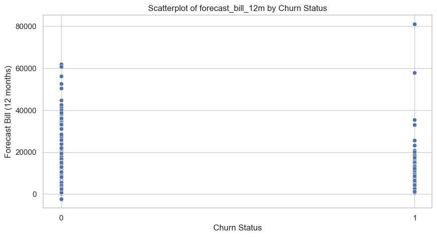</a>
   </p>
<p align="center">
   Fonte: Elaboração própria
</p>
<br>
   
&emsp;&emsp;**Análise após plotagem dos gráficos:** Hipótese negada. Os clientes com estimativas de custo inferiores a 20.000 euros têm maior probabilidade de abandono. Como consequência, os clientes com custos estimados superiores a 20.000 euros têm maior probabilidade de permanecer.
<br>

#### Hipótese 2:

&emsp;&emsp;O segundo gráfico relaciona a coluna 'pow_max' e a coluna 'churn', com o objetivo de entender se os clientes que possuem maior contrato de energia, também tem maior chance de churn.

<br>
<p align="center">
   <b>Gráfico 05 -</b> Gráfico de dispersão dos dados de "power_max" por "churn"
</p>
   <p align="center">
      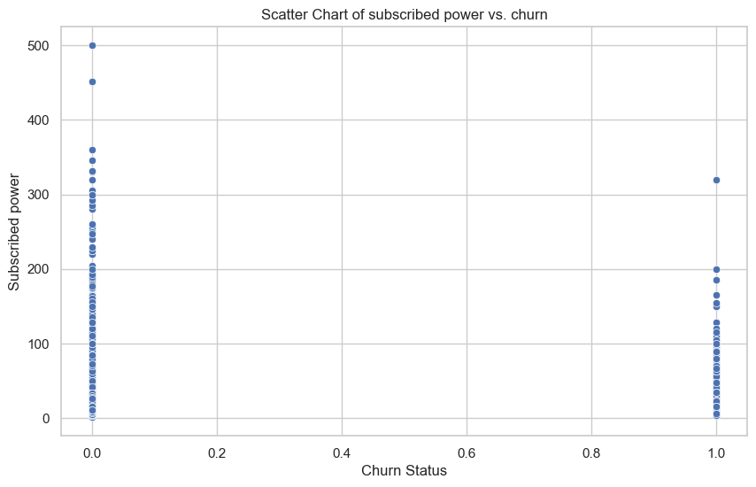</a>
   </p>
<p align="center">
   Fonte: Elaboração própria
</p>
<br>


&emsp;&emsp;**Análise após plotagem dos gráficos:** Hipótese aceita. Clientes que possuem maior poder subscrito também têm menor chance de desligamento. Bem, os clientes com 'pow_max' mais baixo têm maior probabilidade de se desligar.
<br>

#### Hipótese 3:

&emsp;&emsp;O terceiro gráfico relaciona os 'channel_sales' e a coluna 'churn', com o objetivo de entender se existe impacto no churn, a depender do canal de vendas utilizado para converter o cliente.

<br>
<p align="center">
   <b>Gráfico 06 -</b> Gráfico de barras dos dados de "channel_sales" por "churn"
</p>
   <p align="center">
      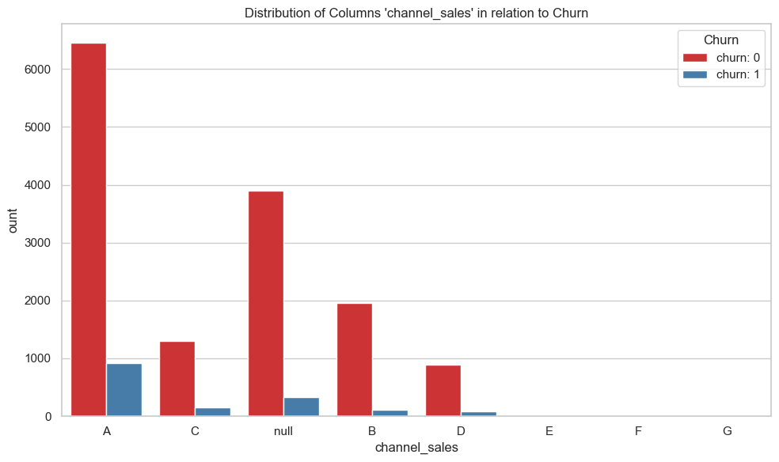</a>
   </p>
<p align="center">
   Fonte: Elaboração própria
</p>
<br>

&emsp;&emsp;O quarto gráfico mostra a proporção entre os 'channel_sales' e a coluna 'churn', com o objetivo de entender quais são os canais de vendas que mais impactam no churn.

<br>
<p align="center">
   <b>Gráfico 07 -</b> Gráfico de barras dos dados de "channel_sales" em relação a "churn"
</p>
   <p align="center">
      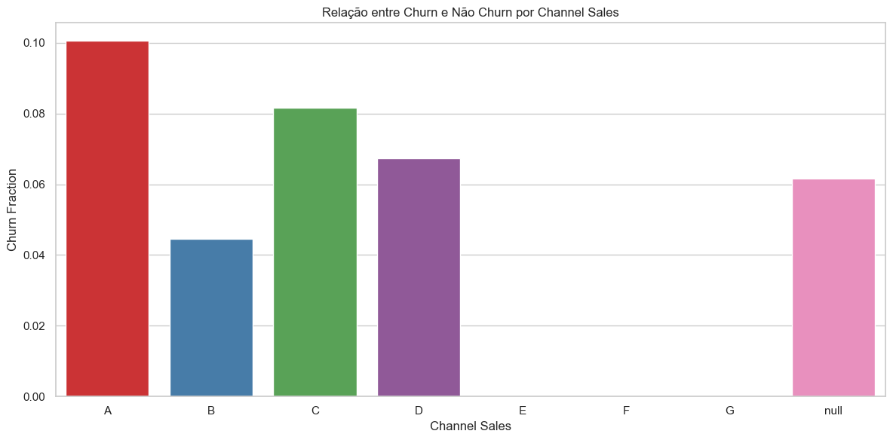</a>
   </p>
<p align="center">
   Fonte: Elaboração própria
</p>
<br>


&emsp;&emsp;**Análise após gráficos plotados:** Hipótese aceita. O churn varia dependendo do canal de vendas utilizado. A maior taxa de rotatividade vem de A.
</p>
<br>

### 4.3. Preparação dos Dados e Modelagem

#### a) Modelagem para o problema

**Entendimento geral do problema:**

&emsp;&emsp;O problema proposto é um caso de análise e predição de churns utilizando um modelo preditivo de classificação. As bases de dados fornecidas foram das informações dos clientes, contendo seu consumo, contratos pagos, potência de energia utilizada e outras informações relevantes sobre como os serviços da *PowerCo* são utilizados. Outra base de dados importante é a dos preços que os respectivos clientes pagam por esses serviços, sendo eles as informações de preço fixo e preço variável pagos em três períodos de um dia.

&emsp;&emsp;A partir dessas informações, é notável que informações de consumo e como elas se relacionam com o que é pago pelos clientes, sendo assim, colunas relacionadas com esse tipo de variáveis serão de suma importância para que a predição possa ser feita de maneira eficiente e relacionada com o que é mais importante para diminuir a taxa de churns.

**Propostas de features com explicações:**

- **Features categóricas / de serviços:** [activity_new, channel_sales, nb_prod_act, origin_up]

&emsp;&emsp;As colunas categóricas e de serviços são de suma importância para qualquer processo de modelagem, principalmente por facilitar o processo de separação em grupos por parte do modelo. O principal tratamento de dados das colunas categóricas foi o processo de one-hot-encoding que consiste em tranformar as categorias em colunas numéricas binárias, assim garantindo que o modelo seja capaz de identificar a qual categoria cada cliente pertence. Esse processo foi necessário porque algumas categorias e serviços impactam diretamente no nível de consumo e preço pago pelo cliente. Uma evidência para comprovar essa relação foi o agrupamento dos clientes pelo seu tipo de contrato e pelo número de serviços utilizados que gerou diferentes níveis de consumo por agrupamento, segue trecho do output:

<br>
<p align="center">
   <b>Quadro 04 -</b> Output simplificado da inputação de médias por agrupamento
</p>

```python
'''
channel_sales  top1_activity_new  nb_prod_act
A              0                  1                42318.84
                                  2                51152.07
                                  3                65681.57
                                  4                34327.04
                                  5                34867.82
                                  6                10707.00
                                  8               790822.00
                                  31              316796.00
               1                  1              1054782.68
                                  2              2126684.18
                                  3              2081429.00
                                  5              2098267.25
                                  6               913608.50
                                  32             5322441.00
B              0                  1               126313.07
                                  2               265088.80
                                  3               195149.88
                                  4               137514.00
                                  5                31501.00
                                  6                 3141.00
                                  31              316796.00
                                  32             5322441.00
               1                  1               969556.94
                                  2              2577140.30
                                  3              1057277.00
                                  4               834128.00
                                  5              2256171.00
                                  6               718782.00
                                  8              1599694.00
C              0                  1                17332.89
                                  2                22629.44
                                  3                16629.74
                                  4                22903.09
                                  5                81129.40
                                  6                65401.50
               1                  1                42588.50
                                  2              3329244.00
                                  8               723996.00
D              0                  1                34794.84
'''
```
<p align="center">
   Fonte: Elaboração própria
</p>
<br>

&emsp;&emsp;O uso dessa estratégia potencializou o poder do modelo de separar quais tipos de clientes teriam maior ou menor chance de dar churn ou não, fazendo com que a predição se torne mais robusta e coerente.
&emsp;&emsp;Ademais, essa estratégia também foi utilizada para o preenchimento de valores incoerentes e valores faltantes presentes na tabela, o uso desse método também garantiu uma performance melhor do que apenas dropar as colunas.

- **Features de consumo:** [cons_12m, cons_las_month, imp_cons, pow_max]

&emsp;&emsp;Como citado anteriormente no entendimento do negócio, uma suspeita existente entre o parceiro de projeto e pela dedução dos membros do grupo é de que os preços estão relacionados com o quão propenso um cliente está de dar churn ou não. Um tipo de feature muito relacionada com o preço pago pelos clientes é justamente o quanto que ele consome durante um período, sendo esse tipo de variável importante para ser utilizada em conjunto com as features de preços. Ademais, o consumo também está relacionado com os serviços utilizados pelos clientes, já que quanto mais serviços provavelmente maior será o consumo dos clientes.

- **Features relacionadas ao 'gás':** [cons_gas_12m, has_gas]

&emsp;&emsp;Um ponto importante a ser destacado sobre o entendimento do negócio é o que a *PowerCo* também fornece serviços de gás para seus clientes, ou seja, não se limita apenas ao comércio de energia elétrica. Levando esse ponto em consideração, uma hipótese levantada foi se o uso / não uso do gás poderia influenciar no churn ou não, precisamente por conta disso, os testes de modelagem estão sendo realizados utilizando essas variáveis para compreender como o modelo reagem à elas. Em um próximo processo iterativo do CRISP-DM, por meio das técnicas de SHAP, faremos a verificação do nível de importância dessas variáveis para o modelo, matemáticamente falando, e assim será decidido seu uso ou aplicação de outras estratégias de engenharia de features para garantir maior eficiência.

- **Features de datas:** [num_years_antig]

&emsp;&emsp;Embora existissem outras colunas de datas, nesse processo iterativo do CRISP-DM, não foi realizado um processo mais rígido de abstração dessas colunas para que novas features pudessem ser criadas, um motivo para isso foi que uma abstração que seria feita era da subtração das datas de cancelamento de contrato pelas datas de início do contrato para obter a duração dos contratos, entretant já existia a coluna "num_years_antig" não sendo necessário fazer essa operação.

- **Features de forecast:** [forecast_cons_12m, forecast_cons_year]

&emsp;&emsp;No decorrer da tabela, existiam muitos valores de forecast, sendo eles uma espécie de previsão do quanto que os clientes gastariam dentro dos próximos 12 meses. Existiam outras colunas de previsão, mas que possuiam uma grande quantidade de valores faltantes, assim sendo complexo de aplicá-las no modelo pois poderiam causar muito ruído no mesmo. Sendo assim, apenas as colunas com a maior quantidade de informações foram mantidas.
Essas features foram consideradas importantes devido a possivelmente clientes que fossem ter um alto gasto nos próximos meses terem maior probabilidade de darem churn, sendo assim, foi decidido aplicar essas colunas no modelo para verificar essa hipótese por meio de testes.

- **Features de lucro / preço:** [net_margin, price_p1_var, price_p2_var, price_p3_var, price_p1_fix, price_p2_fix, price_p3_fix]

&emsp;&emsp;Outras features que estão muito relacionadas com o entendimento do negócio são as de preço e lucro que cada cliente gera para a *PowerCo*, já que uma das suspeitas da própria empresa é de que os preços são um fator decisivo para os clientes darem churn ou não. Precisamente por esse motivo, as colunas de preço foram imeditamente tratadas para a verificação da eficiência dos modelos com seu uso.

- **'Unused features':** [forecast_base_bill_ele, forecast_discount_energy, forecast_meter_rent_12m, forecast_price_energy_p1, forecast_price_energy_p2, forecast_price_pow_p1, forecast_bas_bill_elle forecast_base_bill_year, forecast_base_12m, forecast_cons, margin_gross_pow_ele, margin_net_pow_ele, date_activ, date_end, date_first_activ, date_modif_prod, date_renewall]

&emsp;&emsp;Algumas colunas não foram utilizadas para o processo de predição nessa primeira fase do CRISP-DM, muito disso se deve pelo fato de existem valores faltantes em excesso, principalmente no caso das colunas de forecast, ou de existirem valores ruidosos em excesso de modo que tornou o processo de limpeza desses dados incertos e ruidosos. Sendo assim, no primeiro momento da iteração do CRISP-DM, foi decidido não utilizar colunas que poderiam causar graves ruidos para o modelo. Naturalmente, em outras iterações novas colunas serão adicionadas ou abstraidas para a criação de informações mais úteis para o modelo.

#### b) Discussão das métricas

&emsp;&emsp;Durante a terceira sprint, realizamos testes em modelos usando os dados já tratados. Iniciamos testando os seguintes modelos: CatBoost, Random Forest, KNN, XGBoost e Logistic Regression.

&emsp;&emsp;A escolha de testar um modelo preditivo com vários algoritmos, como CatBoost, Random Forest, KNN, XGBoost e Logistic Regression, é essencial para garantir uma abordagem abrangente na busca pelo melhor desempenho. Cada algoritmo tem suas próprias características e suposições subjacentes, o que significa que eles podem se destacar em diferentes tipos de problemas. Realizar testes com múltiplos modelos permite avaliar completamente o desempenho em diversos cenários, ajudando a identificar qual algoritmo se adapta melhor ao conjunto de dados e ao objetivo do projeto. Além disso, essa abordagem ajuda na detecção de possíveis problemas, como overfitting ou underfitting, e fornece uma base sólida para a seleção final do modelo mais eficaz para a solução preditiva.

&emsp;&emsp;Em cada um dos testes, utilizamos tanto a acurácia quanto a AUC-ROC e o Recall como métricas de avaliação do nosso modelo. Escolhemos essas métricas pelos seguintes motivos:

&emsp;&emsp;A acurácia fornece uma medida geral da capacidade do modelo de fazer previsões corretas em todas as classes.

&emsp;&emsp;A AUC-ROC mede a capacidade do modelo de distinguir entre as classes positiva e negativa, independentemente do threshold.

&emsp;&emsp;O Recall mede a proporção de exemplos positivos que o modelo conseguiu identificar corretamente em relação ao número total de exemplos positivos.

&emsp;&emsp;Para facilitar a comparação entre os modelos, criamos uma tabela que resume as métricas de desempenho de todos os modelos testados até agora.

<br>
<p align="center">
   <b>Tabela 02 -</b> Comparação das métricas dos modelos testados
</p>

| Modelo              | Accuracy | AUC ROC | Recall |
| ------------------- | -------- | ------- | ------ |
| CatBoost            | 0.901    | 0.640   | 0.009  |
| Random Forest       | 0.905    | 0.619   | 0.053  |
| KNN                 | 0.893    | 0.539   | 0.006  |
| XGBoost             | 0.900    | 0.637   | 0.003  |
| Logistic Regression | 0.900    | 0.5948  | 0.0    |

<p align="center">
   Fonte: Elaboração própria
</p>
<br>
&emsp;&emsp;Nossos dados de churn estão muito desbalanceados, e o CatBoost é um algoritmo de aprendizado de máquina usado exatamente nesses casos. Por isso, iniciamos os testes de modelo com ele. Este modelo teve um dos melhores resultados nos testes, com 90% de acurácia e 64% de AUC ROC. Apesar de ainda não ter uma ROC satisfatória, ele se mostrou um possível candidato para modelo, já que é ideal para bases de dados desbalanceadas. Na sprint 4, vamos realizar novos testes com hiperparâmetros e balanceamento dos dados.

&emsp;&emsp;Testamos o modelo random forest, que é um modelo complexo que lida bem com conjuntos de dados grandes e de alta dimensão. Suas métricas foram um pouco menores do que as do CatBoost, o que ainda não é suficiente para descartar seu possível uso em futuros testes.

&emsp;&emsp;Escolhemos testar o modelo com o KNN, já que é um algoritmo de aprendizado de máquina usado para tarefas de classificação e regressão. Através deste teste, percebemos que o modelo KNN não teve tanta facilidade para distinguir as classes "churn" e "non-churn", mas seria interessante trabalhar mais na engenharia de features e realizar novos testes.

&emsp;&emsp;Testamos o modelo com o XGBoost, porque ele pode lidar de forma eficiente (e robusta) com uma ampla variedade de diferentes tipos de dados. Os resultados foram pouco satisfatórios, já que acertou apenas um "churn" verdadeiro e um "não churn" verdadeiro.

&emsp;&emsp;Realizamos o teste com o modelo de regressão logística, pois este modelo é uma boa escolha quando estamos lidando com um problema de classificação binária, onde o objetivo é prever uma saída binária (no nosso caso, churn/not churn). Esse modelo não teve resultados de métricas muito diferentes dos anteriores, mas é importante perceber que ele errou todos os verdadeiros positivos na matriz de confusão, o que é bem atípico no desenvolvimento de modelos preditivos.

&emsp;&emsp;Em resumo, nossa análise abrangente dos diferentes modelos de aprendizado de máquina revelou que nossos testes resultaram em resultados muito promissores e até o momento satisfatórios. Portanto, nossa próxima etapa será aprimorar esses modelos, explorando ajustes de hiperparâmetros e estratégias de balanceamento de dados, com o objetivo de otimizar nossa capacidade de prever o churn e melhorar nosso sistema de retenção de clientes.

#### c) Discussão do primeiro modelo candidato

&emsp;&emsp;Para comentar sobre o modelo escolhido, é importante explicar que, nesta etapa, uma série de testes foi realizada com várias técnicas de balanceamento da base de dados. No entanto, mesmo após essas tentativas, a matriz de confusão e as métricas do modelo não saíram do padrão que tínhamos anteriormente. Os modelos demonstraram grande habilidade em identificar os "não churns", mas enfrentaram consideráveis dificuldades ao tentar identificar os "churns" propriamente ditos.

&emsp;&emsp;É importante ter isso em mente porque o "primeiro melhor modelo escolhido" não difere muito da maioria dos outros modelos testados, ele apresenta um alto índice de acerto dos "não churns" e erra muito na classificação dos "churns" assim como os outros. A hipótese levantada é que o modelo não tem amostras de "churns" o suficiente para conseguir identificá-los, e mesmo as que possui, são muito próximas de exemplos de "não churns" fazendo com que ele tenha uma imensa dificuldade de diferenciação. Precisamente por conta disso, esse modelo não apresenta métricas tão boas e nem uma matriz de confusão suficientemente boa.

```python
from sklearn.ensemble import RandomForestClassifier

def modeling(model, X_train, y_train, X_valid, y_valid, name):
    model.fit(X_train, y_train)
    y_pred = model.predict(X_valid)

    accuracy = accuracy_score(y_valid, y_pred)
    roc_auc = roc_auc_score(y_valid, model.predict_proba(X_valid)[:, 1])
    recall = recall_score(y_valid, y_pred)
    f1 = f1_score(y_valid, y_pred)
    confusion = confusion_matrix(y_valid, y_pred)

    print(confusion)

    print("Accuracy:", accuracy)
    print("AUC ROC:", roc_auc)
    print("Recall:", recall)
    print("F1 Score:", f1)

    labels = ["Not churn", "churn"]

    sns.heatmap(confusion, annot=True, fmt='d', cmap='Reds', xticklabels=labels, yticklabels=labels)
    plt.xlabel('Predicted')
    plt.ylabel('Actual')
    plt.title(f'Confusion matrix - {name}')
    plt.show()

modeling(RandomForestClassifier(random_state=8081),
X_train, y_train, X_valid, y_valid, 'Random forest')

# simple output:
'''
confusion matrix:
[[2898    3]
 [ 302   17]]

Accuracy: 0.90527950310559
AUC ROC: 0.6194232018145294
Recall: 0.05329153605015674
F1 Score: 0.10029498525073746
'''

# Matriz de confusão invertida:
'''
confusion matrix:
[[2898    3]
 [ 17   302]]
'''
```

&emsp;&emsp;Entretanto, o principal ponto que tivemos desses testes é que o modelo se tornou muito bom em errar os churns, tão bom que se nós simplesmente invertessemos esses resultados ele seria capaz de acertar na maior parte das vezes.

&emsp;&emsp;Com isso, foi chegada à conclusão de que seria interessante mudarmos a nossa abordagem. Ao invés de simplesmente fazer um modelo que seja capaz de prever churns, seria interessante treinar modelos que sejam capazes de identificar os "não churns" falsos. Por meio dessa abordagem que ainda será testada, talvez nós consigamos encontrar uma resposta mais apropriada para o problema já que tão dificil quanto acertar 90% das vezes também é errar 90% das vezes.

&emsp;&emsp;Por ora, o modelo apresentado é um random forest que foi o modelo mais utilizado para os testes da maioria das técnicas de balanceamento. E, ao final, apresentamos uma reversão de seus valores para mostrar que simplesmente os alterando, o modelo seria capaz de ter um ótimo desempenho e prever a maioria dos churns.

&emsp;&emsp;Outros dois modelos de suma importância para a interpretação dos dados foram o catboost, um modelo ajustado para bases de dados desbalanceadas e o random forest regressor após o processo de SMOTE-ENN realizado para balancear a base de dados.

```python
from catboost import CatBoostClassifier

catB = CatBoostClassifier(iterations=1000, depth=6, learning_rate=0.1, loss_function='Logloss', verbose=200, random_state=8081)
modeling(catB, X_train, y_train, X_valid, y_valid, 'Random forest')

# simple output:
'''
confusion matrix:
[[2901    0]
 [ 316    3]]

Accuracy: 0.901863354037267
AUC ROC: 0.6407594830017539
Recall: 0.009404388714733543
F1: 0.018633540372670808
'''

from imblearn.combine import SMOTEENN

smote_enn = SMOTEENN(sampling_strategy='auto', random_state=8081)
X_train_SMOTE_ENN, y_train_SMOTE_ENN = smote_enn.fit_resample(X_train, y_train)

rfc_SMOTE_ENN = RandomForestClassifier(random_state=8081)
modeling(rfc_SMOTE_ENN, X_train, y_train, X_valid, y_valid, 'Random forest SMOTE-ENN')

# simple output:
'''
confusion matrix:
[[2417    484]
 [ 237    82]]

Accuracy: 0.7760869565217391
AUC ROC: 0.6014043368463365
Recall: 0.25705329153605017
F1: 0.18531073446327684
'''

```

&emsp;&emsp;Esses dois modelos em específico não passaram pelo processo de inversão dos valores de suas predições e foram os que tiveram os melhores resultados dentre os modelos treinados. O modelo catboost é adapatado para bases de dados desbalanceadas, portanto seu uso foi imprescindìvel para a avaliação do comportamento das features para os modelos preditivos. Ademais, o uso das técnicas de SMOTE foram muito importantes para a realização de uma análise mais profunda em situações mais balanceadas, mas que ainda foi um grande desafio devido a diferença gritante entre a quantidade das amostras.

<br>

### 4.4. Comparação de Modelos

&emsp;&emsp;A otimização de hiperparâmetros desempenha um papel crítico no desenvolvimento de modelos preditivos de alta precisão. A escolha criteriosa dos valores ideais para esses hiperparâmetros pode representar a diferença entre um modelo que mal se ajusta aos dados e um modelo altamente preciso e eficaz. Nesse contexto, implementamos a sintonização de hiperparâmetros em nosso modelo preditivo em desenvolvimento, avaliando o desempenho de cinco algoritmos amplamente utilizados: CatBoost, Random Forest, K-Nearest Neighbors (KNN), XGBoost e Logistic Regression. Através da análise desses modelos ajustados, procuramos identificar quais configurações se destacaram em termos de desempenho e como esses ajustes afetaram a capacidade de previsão do modelo. Após a realização desses testes, utilizamos as métricas mencionadas na seção 4.3, tópico "b", para medir a qualidade dos testes.

<br>
<p align="center">
   <b>Tabela 03 -</b> Comparação das métricas dos modelos testados com hiperparâmetros
</p>

| Modelo com Hiperparâmetro | Accuracy | AUC ROC | Recall |
| ------------------------- | -------- | ------- | ------ |
| CatBoost                  | 0.901    | 0.642   | 0.014  |
| Random Forest             | 0.905    | 0.619   | 0.053  |
| KNN                       | 0.899    | 0.575   | 0.023  |
| XGBoost                   | 0.901    | 0.639   | 0.009  |
| Logistic Regression       | 0.900    | 0.624   | 0.0    |

<p align="center">
   Fonte: Elaboração própria
</p>
<br>
&emsp;&emsp;Nesta fase, foi realizada uma pesquisa em grade (Grid Search) para determinar os melhores hiperparâmetros para o CatBoost. Um dos principais hiperparâmetros a serem considerados é o "class_weights", especialmente porque estamos lidando com um conjunto de dados desequilibrado. Esse hiperparâmetro atribui maior importância a uma classe em relação à outra.

&emsp;&emsp;Além disso, foram conduzidos testes semelhantes usando o Grid Search nos modelos KNN, XGBoost e Regressão Logística. O Grid Search é uma técnica de otimização de hiperparâmetros que oferece várias vantagens quando aplicada a problemas de machine learning, tais como: explorar todas as combinações possíveis de valores de hiperparâmetros dentro de um espaço predefinido, facilidade de interpretação e uma avaliação abrangente do espaço de hiperparâmetros.

&emsp;&emsp;Os resultados dos testes com hiperparâmetros no KNN mostraram métricas muito semelhantes às métricas do teste do modelo sem hiperparâmetros. No entanto, a matriz de confusão indicou menos acertos em verdadeiros positivos, o que sugere limitações para a aplicação desse modelo em nosso projeto. Com base nisso, decidimos não prosseguir com os testes no modelo KNN.

&emsp;&emsp;No caso do modelo XGBoost com hiperparâmetros, foi possível observar métricas muito semelhantes às métricas do teste do modelo sem hiperparâmetros. Embora tenhamos visto uma pequena melhoria nos verdadeiros positivos na matriz de confusão, o resultado ainda não atingiu um nível satisfatório. Portanto, optamos por não continuar os testes com o modelo XGBoost.

&emsp;&emsp;Quanto ao modelo de Regressão Logística com hiperparâmetros, não foram vistas alterações nas métricas em comparação com o teste do modelo sem hiperparâmetros. Com base nesses resultados, foi decidido não prosseguir com os testes no modelo de Regressão Logística.

&emsp;&emsp;No caso do Random Forest, foram aplicados hiperparâmetros usando a técnica "random search", que tem a vantagem de explorar uma variedade maior de combinações e ser menos suscetível a overfitting em comparação com o Grid Search. Os resultados dos testes com hiperparâmetros no modelo Random Forest mostraram métricas muito semelhantes às métricas do teste do modelo sem hiperparâmetros. Embora não tenha sido decidido usar esses modelos individualmente no projeto, o plano é incorporar todos os modelos com hiperparâmetros em um processo de pós-processamento.

&emsp;&emsp;Na busca por modelos preditivos de alta precisão, a otimização de hiperparâmetros é crucial. A análise abrangente de cinco algoritmos e a exploração das técnicas de Grid Search e Random Search forneceram uma visão clara das vantagens e limitações de cada abordagem. Com base nos resultados, a tomada de decisão informada sobre quais modelos prosseguir e como integrá-los em um processo de pós-processamento demonstra a importância de uma abordagem estratégica na otimização de hiperparâmetros.

<br>

**Modelo adicional - Hipótese do pós processamento**

&emsp;&emsp;Além dos esforços para realizar a tunagem de hiperparâmetros, também foi desenvolvida uma hipótese de solução para o problema da predição dos churns que surgiu a partir de dificuldades enfretadas devido a base de dados desbalanceada.

&emsp;&emsp;Primeiramente, para chegar nessa hipótese, foi realizada uma série de treinamentos de uma grande variedade de modelos utilizando técnicas diferentes para cada um deles. Com todos esses treinos, foi percebido um padrão: todos os modelos se tornavam muito bons em identificar a classe "não churn", porém tinham uma grande dificuldade para identificar a classe "churn". Sendo assim, bastaria que as predições erradas da classe churn fossem invertidas para se obter resultados melhores.

&emsp;&emsp;Foi com base nisso que estabeleceu-se a hipótese do pós processamento, que consiste na separação da modelagem em "duas". A primeira modelagem corresponde à junção da predição de vários modelos preditivos que já testamos, sendo eles: Catboost, Random forest, knn, xgboost e a logistic regression. Além de reunir a predição desses 5 modelos, ainda os treinamos sob diferentes estratégias de balanceamento, tais quais: SMOTE, SMOTE ENN, SMOTE ADASYN, SMOTE BOOST, Undersampling e Oversampling. A partir disso, foi gerada uma série de predições que são reunidas para formar um meta-modelo que será utilizado de forma intermediária para um segundo processo de modelagem.

&emsp;&emsp;A segunda modelagem considera os dados das diversas predições que foram geradas pelo meta-modelo e os reune com as features originais de modo a criar um novo padrão para os dados já existentes. A ideia é que esse segundo modelo se torne capaz de identificar os erros das predições geradas anteriormente e use isso para corrigir os "churns", que foram erroneamente classificados como "não churn".

&emsp;&emsp;Desse modo, foram desenvolvidos basicamente dois modelos: um especializado em identificar a classe "não churn", e outro focado em corrigir os erros do primeiro modelo, assim criando uma predição ótima para ambos os casos. Seguem as métricas obtidas desse modelo de pós processamento.

<br>
<p align="center">
   <b>Tabela 04 -</b> Métricas do primeiro modelo escolhido
</p>

| Modelo com Hiperparâmetro | Accuracy | AUC ROC | Recall |
| ------------------------- | -------- | ------- | ------ |
| Random forest p_p         | 0.996    | 0.987   | 0.974  |

<p align="center">
   Fonte: Elaboração própria
</p>
<br>

### 4.5. Avaliação

&emsp;&emsp;Após uma série de análises e testes com diversos modelos preditivos, foi desenvolvida uma solução para a predição de churn que usa como base o modelo XGBoost. 

&emsp;&emsp;O XGBoost funciona por meio da construção de um conjunto de árvores de decisão simples, essas são chamadas de "árvores fracas". O motivo de sua simplicidade é porque elas são rasas, não possuem grande profundidade e nem grandes ramificações, e, precisamente por conta disso, suas previsões sozinhas não são suficientemente boas. Entretanto, o XGBoost realiza um processo iterativo com essas árvores fracas, se concentrando em identificar e corrigir os erros cometidos pelas mesmas e adiciona novas árvores ao conjunto. Dessa forma, as novas aprendem com os erros das antigas e, além disso, uma ponderação é feita para que árvores com mais acertos ganhem mais importância em relação às outras. Por fim, é realizada a combinação das previsões, assim resultando em métricas mais precisas aos problemas estabelecidos.

&emsp;&emsp;Voltando ao problema proposto, o setor de energia é de vital importância para a sociedade, em especial por meio de fontes como gás e outras fontes não renováveis. Esse mercado é extremamente competitivo  e faz com que os clientes tenham muito poder sobre a empresa, tendo em vista que possuem diversas opções no mercado. Precisamente por isso, a *PowerCo*, empresa que propôs o problema a ser resolvido, registrou um aumento significativo no número de cancelamento de contratos de seus clientes, ou seja, o índice de churn aumentou. Para sanar esse problema, foi proposto o uso de modelos preditivos para prever quais clientes que dariam ou não churn na empresa. Como resultado da aplicação de um sistema como esse, a *PowerCo* teria maior facilidade para identificar os clientes com chances maiores de cancelarem seus contratos com a empresa e, por meio disso, conseguiria realizar ações direcionadas para prevenir esses churns.

<br>
<p align="center">
   <b>Tabela 05 -</b> Métricas do XGBoost com hiperparâmetros
</p>

| Modelo                  | Accuracy | AUC ROC | Recall |
| ----------------------- | -------- | ------- | ------ |
| XGBoost hyperparameter  | 0.902    | 0.667   | 0.028  |
<p align="center">
   Fonte: Elaboração própria
</p>
<br>

&emsp;&emsp;Apesar do modelo proposto mostrar-se útil como uma ferramenta para a identificação do churn de clientes, é válido ressaltar que, sozinho, o mesmo não é capaz de prever todos os casos de cancelamento. Ademais, não é essa ferramenta que realiza o trabalho de retenção desses clientes, ficando essa função sob responsabilidade de um(a) possível gestor(a) de contas, que fará uso do modelo preditivo.

&emsp;&emsp;Em sua forma mais básica, é possível utilizar o modelo preditivo diretamente pelo noteboook disponibilizado no projeto. Basta inserir os dados que se desejam ser previstos com a mesma estrutura que foi passada inicialmente e, assim, obtem-se as predições corretas ao final do jupyter notebook.

&emsp;&emsp;Uma proposta mais interessante para o uso da ferramenta do modelo preditivo é a integração desse código com alguma interface para o uso de um(a) possível getor(a) de contas, que usará o modelo como uma ferramenta de auxílio para lidar com os clientes com maiores chances de cancelarem seus contratos de serviços. Uma boa proposta de integração para isso é um CRM (Customer Relationship Management). Em suma, um CRM refere-se a um conjunto de estratégias, práticas e tecnologias utilizadas para gerenciar o relacionamento com os clientes. Essa ferramenta poderia ser utilizada para a criação de uma interface integrada com o modelo preditivo, de modo que a persona utilize o modelo de forma fácil e escalável.

&emsp;&emsp;Assim como em outros modelos preditivos, o modelo desenvolvido nesse projeto não é capaz de prever 100% dos casos, fato esse que até mesmo poderia caracterizá-lo como um caso de overfit. Entretanto, para esse caso de cancelamento de contrato por parte de clientes, algumas ações podem ser tomadas para evitar que essas previsões não afetem negativamente a *PowerCo*. Um dos primeiros e mais fundamentais processos é levar em consideração a porcentagem de chance dos clientes cancelarem ou não seus constratos, tendo em vista que clientes com uma alta probabilidade de dar um churn, mas que não foram classificados como tal, podem passar por algum processo de atendimento ao cliente, tendo suas dores ouvidas e diminuindo as chances desse cancelamento.

&emsp;&emsp;Para todo projeto de machine learning, é importante garantir a explicabilidade do modelo, ou seja, demonstrar por meio da interpretação e compreensão do negócio quais são as features e fatores mais importantes que levaram o modelo a chegar a determinada decisão. Ao aplicar-se o seguinte código, obtém-se um panorama de quais foram os principais fatores que influenciaram as predições do modelo escolhido.

```python
import xgboost as xgb

# Training xgboost
xgboost = xgb.XGBClassifier()
xgboost.fit(X_train, y_train)

# Obtaining the importance of features
importances = xgboost.feature_importances_

# Creating a DataFrame to visualize feature importances
feature_importance_df = pd.DataFrame({'Feature': X.columns, 'Importance': importances})
feature_importance_df = feature_importance_df.sort_values(by='Importance', ascending=False)

print(feature_importance_df)

# simple output:
'''
               Feature  Importance
19         origin_up_A    0.143833
1    top1_activity_new    0.052842
20         origin_up_B    0.043313
5      channel_sales_D    0.042217
10            cons_12m    0.038772
12     cons_last_month    0.038703
13   forecast_cons_12m    0.036567
18     num_years_antig    0.035773
29        price_p3_var    0.035590
28        price_p2_var    0.035120
9   channel_sales_null    0.034445
27        price_p1_var    0.034113
31        price_p2_fix    0.032660
15             has_gas    0.031754
26             pow_max    0.031267
4      channel_sales_C    0.031169
14  forecast_cons_year    0.031096
3      channel_sales_B    0.030589
16            imp_cons    0.030464
11        cons_gas_12m    0.029698
2      channel_sales_A    0.029248
30        price_p1_fix    0.029218
32        price_p3_fix    0.028500
21         origin_up_C    0.027576
0      no_activity_new    0.027170
17         nb_prod_act    0.021192
25      origin_up_null    0.017111
'''
```

&emsp;&emsp;Por meio desse trecho de código e do output apresentado, percebe-se que uma série de features foram de suma importância para tornar o modelo capaz de identificar e classificar os casos de churn negativo e de churn positivo. Dentre os principais conjuntos de features que se destacam, estão:
- Por qual canal o cliente fechou seu contrato,
- Seu consumo, tanto de gás, quanto de energia elétrica,
- A quantidade de serviços que o mesmo utiliza,
- O preço, tanto variável, como fixo para os diferentes períodos do dia.

&emsp;&emsp;Esses resultados estão alinhados às soluções que foram apresentadas para lidar com o problema do churn dos clientes, já que elas estão em volta, principalmente, de pacotes de serviços, oferecimento de descontos e a integração desse sistema com um CRM, o que tornaria o contato e relacionamento com os clientes muito mais próximos, resultando na diminuição do índice de churn.

## <a name="c5"></a>5. Conclusões e Recomendações

&emsp;&emsp;O modelo apresenta seus principais resultados na forma de lucro, o qual a empresa mantém ao aumentar a retenção de clientes. Em outras palavras, ele identifica os clientes com maior probabilidade de cancelamento (churn) e, assim, permite a implementação de ações para evitar esse cenário. Dessa forma, os casos de rescisão de contrato são prevenidos, e o valor gerado por esses clientes continua sendo preservado, evitando gastos e investimentos para reconquistar clientes antigos. É recomendado que essa solução seja utilizada como uma ferramenta e auxílio para análise do perfil dos clientes, ajudando na identificação dos casos de cancelamento de contrato.

&emsp;&emsp;Uma ferramenta extra, altamente recomendada para o uso do modelo preditivo, é sua integração com alguma interface que facilite seu uso, principalmente para usuários que não utilizam a tecnologia tão constantemente em seu dia a dia. Uma proposta interessante, que já foi apresentada anteriormente, é o uso dessa solução em conjunto com um sistema de CRM, que faça com que um(a) gestor(a) de contas (tal qual a que foi apresentada como uma persona) possa fazer uso da ferramente para predição de churns de clientes com facilidade e de forma assertiva para a resolução do problema.

&emsp;&emsp;Os principais afetados pelo uso do modelo preditivo são os clientes da *PowerCo*. Dado análises que foram elaboradas, compreende-se que os impactos éticos do uso do modelo não são tão relevantes a ponto de precisar de ações específicas para lidar com os mesmos. Pode-se notar isso, já que não se trata de um processo de cancelamento dos contratos dos clientes por parte da *PowerCo*, e sim uma ação voluntária dos clientes de darem churn por diversos motivos. A intenção da empresa com tudo isso é aumentar sua retenção de clientes, oferecendo melhores serviços para os mesmos, coisa que o modelo criado auxilia.

&emsp;&emsp;A criação de um modelo preditivo para o cenário com o qual a *PowerCo* se encontra atualmente foi crucial. Ele não somente ajudará a prever e, caso usado de forma correta pelo(a) gestor(a) de contas, evitar a quantidade de clientes que realizarão churn, como, consequentemente, gerará altos índices de lucro para a mesma. Dessa forma, a empresa se adapta e prospera no cenário competitivo atual, solidificando sua posição de destaque no mercado.

<br>

## <a name="c6"></a>6. Referências

RCGI e Total Energies investem R$ 80 milhões em projetos de P&D. Disponível em: <https://energiahoje.editorabrasilenergia.com.br/rcgi-e-total-energies-investem-r-80-milhoes-em-projetos-de-pd/>. Acesso em: 7 ago. 2023.

USP e TotalEnergies firmam parceria para projetos de energia renovável. Disponível em: <https://jornal.usp.br/institucional/usp-e-totalenergies-assinam-parceria-para-projetos-de-energia-renovavel/>. Acesso em: 7 ago. 2023.

French oil giant Total rebrands as Total Energies in climate push. Disponível em: <https://www.google.com/url?q=https://www.france24.com/en/france/20210521-french-oil-giant-total-rebrands-as-total-energies-in-climate-push&sa=D&source=docs&ust=1694439827033181&usg=AOvVaw03-gCdQHiUcDOjT480L7HD>. Acesso em: 7 ago. 2023.

Como será o primeiro leilão de hidrogênio verde do mundo. Disponível em: <https://www.google.com/url?q=https://epbr.com.br/como-sera-o-primeiro-leilao-de-hidrogenio-verde-do-mundo/&sa=D&source=docs&ust=1694439827047435&usg=AOvVaw3qY_KqKtYap3MguMjwP2P->. Acesso em: 8 ago. 2023.

Capacidade de energia renovável deve crescer 33% em 2023, diz agência internacional. Disponível em: <https://www1.folha.uol.com.br/mercado/2023/06/capacidade-de-energia-renovavel-deve-crescer-33-em-2023-diz-aie.shtml#:~:text=A%20capacidade%20de%20energia%20renov>. Acesso em: 8 ago. 2023.

O setor de energia cada vez mais demanda inovações e tecnologia. Disponível em: <https://www.alemdaenergia.engie.com.br/o-setor-de-energia-cada-vez-mais-demanda-inovacoes-e-tecnologia/>. Acesso em: 8 ago. 2023.

Lucro líquido da Total Energies cai 44% no último trimestre de 2022 | Monitor do Mercado. Disponível em: <https://monitordomercado.com.br/noticias/40027-totalenergies-lucro-liquido-cai-44-no-4t22#:~:text=A%20TotalEnergies%20reportou%20lucro%20l>. Acesso em: 8 ago. 2023.

TotalEnergies SE Long Term Debt 2010-2023 | TTE. Disponível em: <https://www.macrotrends.net/stocks/charts/TTE/totalenergies-se/long-term-debt%23:~:text%3DTotalEnergies%2520SE%2520long%2520term%2520debt%2520for%25202022%2520was%2520%252445.264B>. Acesso em: 8 ago. 2023.

Yahoo Search – Busca na Web. Disponível em: <https://br.search.yahoo.com/?fr2=p:fprd>. Acesso em: 8 ago. 2023.

Russia: TotalEnergies continues to implement its principles of conduct and sells its 49% interest in the Russian Termokarstovoye gas field to Novatek. Disponível em: <https://totalenergies.com/media/news/press-releases/russia-totalenergies-continues-implement-its-principles-conduct-and-sells>. Acesso em: 8 ago. 2023.

ANTP - Associação Nacional de Transportes Públicos. Disponível em: <http://www.antp.org.br/noticias/clippings/incertezas-devem-manter-precos-do-petroleo-sob-volatilidade-em-2023.html>. Acesso em: 8 ago. 2023.

Estudo aponta custo anual de US$ 9 tri com transição para energia limpa. Disponível em: <https://veja.abril.com.br/economia/estudo-aponta-custo-de-u-9-tri-anual-com-transicao-para-energia-limpa>. Acesso em: 8 ago. 2023.

Value Proposition - Saiba o que é | Glossário de produto da PM3. Disponível em: <https://www.cursospm3.com.br/glossario/value-proposition/>. Acesso em: 10 ago. 2023.

O que é análise SWOT? Disponível em: <https://www.lucidchart.com/pages/pt/o-que-e-analise-swot#:~:text=A%20an>. Acesso em: 10 ago. 2023.

ALONÇO, G. Planejamento estratégico: Como usar as 5 Forças de Porter? Disponível em: <https://certificacaoiso.com.br/5-forcas-de-porter-serie-planejamento-estrategico/#:~:text=O%20criador%20das%205%20for>. Acesso em: 11 ago. 2023.

PAPOCA, R. O que é matriz de risco? Aprenda como montar + exemplo. Disponível em: <https://blog.esferaenergia.com.br/gestao-empresarial/matriz-de-risco>. Acesso em: 11 ago. 2023.

VALE, J. DO. Como criar personas. Disponível em: <https://medium.com/@judovale/como-criar-personas-15189b5ed199>. Acesso em: 21 ago. 2023.

OSTERWALDER, A. et al. Value Proposition Design: Como construir propostas de valor inovadoras. 1a edição ed. [s.l.] Alta Books, 2019.

Medium. Disponível em: <https://medium.com/doghero-brasil/como-criar-uma-jornada-do-usu>. Acesso em: 21 ago. 2023.

Política de privacidade: porque é importante fazer. Disponível em: <https://www.aradvogadosreunidos.com.br/politica-de-privacidade-porque-fazer/>. Acesso em: 17 set. 2023.

Lean Inception - Laplace. Disponível em: <https://miro.com/app/board/uXjVMuFn2SI=/?share_link_id=244412795815>. Acesso em: 18 set. 2023.

Privacy. Disponível em: <https://totalenergies.com/privacy>. Acesso em: 18 set. 2023.

‌Cookies. Disponível em: <https://totalenergies.com.br/cookies>. Acesso em: 18 set. 2023.